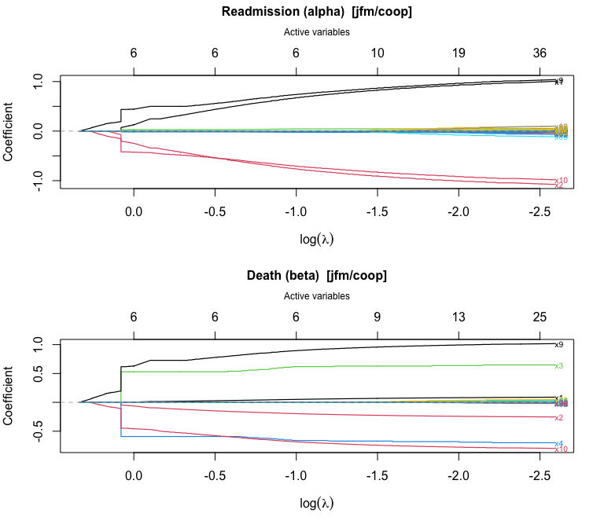
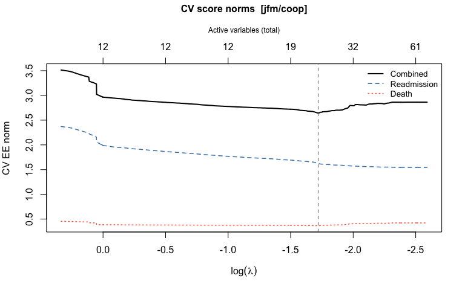
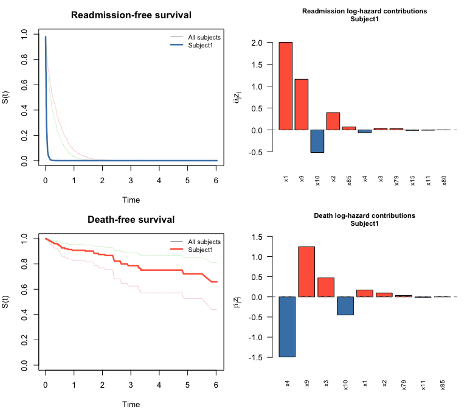
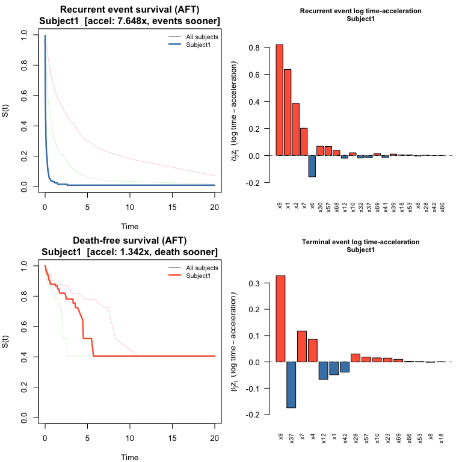
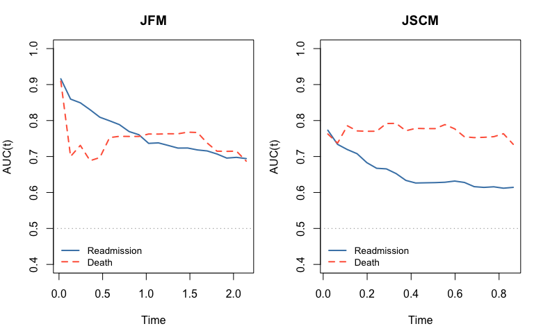

- [swjm: Stagewise Variable Selection for Joint Models of Semi-Competing
  Risks](#swjm-stagewise-variable-selection-for-joint-models-of-semi-competing-risks)
  - [Overview](#overview)
  - [Installation](#installation)
  - [Data format](#data-format)
  - [Workflow](#workflow)
    - [1. Simulate data](#1-simulate-data)
    - [2. Fit the stagewise regularization
      path](#2-fit-the-stagewise-regularization-path)
    - [3. Plot the coefficient path](#3-plot-the-coefficient-path)
    - [4. Cross-validation to select the tuning
      parameter](#4-cross-validation-to-select-the-tuning-parameter)
    - [5. Plot the cross-validation
      results](#5-plot-the-cross-validation-results)
    - [6. Summarize the chosen model](#6-summarize-the-chosen-model)
    - [7. Baseline hazard](#7-baseline-hazard)
    - [8. Predict survival curves](#8-predict-survival-curves)
    - [9. Plot survival curves and predictor
      contributions](#9-plot-survival-curves-and-predictor-contributions)
    - [10. JSCM workflow (cross-validation + survival
      prediction)](#10-jscm-workflow-cross-validation--survival-prediction)
    - [11. Other penalties](#11-other-penalties)
  - [12. Model evaluation](#12-model-evaluation)
    - [12.1 Coefficient recovery](#121-coefficient-recovery)
    - [12.2 Time-varying AUC](#122-time-varying-auc)
  - [Package conventions](#package-conventions)

# swjm: Stagewise Variable Selection for Joint Models of Semi-Competing Risks

## Overview

`swjm` implements stagewise (forward-stepwise) variable selection for
joint models of recurrent events and terminal events (semi-competing
risks). Two model frameworks are supported:

| Model    | Type               | `alpha` (first *p*)    | `beta` (second *p*) |
|----------|--------------------|------------------------|---------------------|
| **JFM**  | Cox frailty        | recurrence/readmission | terminal/death      |
| **JSCM** | Scale-change (AFT) | recurrence/readmission | terminal/death      |

Three penalty types are available: cooperative lasso (`"coop"`), lasso
(`"lasso"`), and group lasso (`"group"`). The cooperative lasso
encourages shared support between the readmission and death coefficient
vectors.

## Installation

``` r
# From the package directory:
devtools::install("swjm")
```

## Data format

All functions expect a data frame with columns `id`, `t.start`,
`t.stop`, `event` (1 = readmission, 0 = terminal/censoring row),
`status` (1 = death, 0 = alive/censored), and covariate columns
`x1, ..., xp`.

------------------------------------------------------------------------

## Workflow

### 1. Simulate data

``` r
library(swjm)

# Joint Frailty Model — scenario 1
set.seed(42)
dat_jfm  <- generate_data(n = 200, p = 100, scenario = 1, model = "jfm")
Data_jfm <- dat_jfm$data

# JSCM — same scenario
set.seed(42)
dat_jscm  <- generate_data(n = 200, p = 100, scenario = 1, model = "jscm")
#> Call: 
#> reReg::simGSC(n = n, summary = TRUE, para = para, xmat = X, censoring = C, 
#>     frailty = gamma, tau = 60)
#> 
#> Summary:
#> Sample size:                                    200 
#> Number of recurrent event observed:             343 
#> Average number of recurrent event per subject:  1.715 
#> Proportion of subjects with a terminal event:   0.175
Data_jscm <- dat_jscm$data
```

JFM data: n = 200 subjects, 380 readmission events, 40 deaths

### 2. Fit the stagewise regularization path

``` r
fit_jfm <- stagewise_fit(Data_jfm, model = "jfm", penalty = "coop")
fit_jfm
#> Stagewise path (jfm/coop)
#> 
#>   Covariates (p):            100
#>   Iterations:                5000
#>   Lambda range:              [0.07494, 1.398]
#>   Active at final step:      42 readmission, 31 death
#>     Readmission (alpha): 1, 2, 3, 4, 5, 8, 9, 10, 11, 12, 13, 14, 15, 18, 23, 28, 32, 41, 44, 50, 52, 56, 60, 63, 64, 67, 69, 70, 71, 73, 74, 76, 77, 78, 79, 80, 82, 83, 85, 87, 92, 95
#>     Death (beta):        1, 2, 3, 4, 5, 8, 9, 10, 11, 12, 13, 28, 32, 41, 50, 52, 56, 60, 64, 67, 69, 74, 76, 77, 78, 79, 82, 83, 85, 92, 98
```

The fit object now exposes `alpha` (readmission) and `beta` (death) as
separate *p* × (*k*+1) matrices — one column per stagewise step — in
addition to the combined `theta` matrix (2*p* × (*k*+1)):

``` r
p <- 100
k_final <- ncol(fit_jfm$alpha)
a_final <- round(fit_jfm$alpha[, k_final], 4)
```

- alpha matrix: 100 rows x 5001 columns
- beta matrix: 100 rows x 5001 columns

Nonzero alpha entries at final step:

``` r
a_final[a_final != 0]
#>  [1]  1.0057 -1.0755  0.0473 -0.0357  0.0050  0.0130  1.0393 -0.9826  0.0197
#> [10]  0.0033 -0.0175 -0.0170  0.0960 -0.0430  0.0520 -0.0030 -0.0232 -0.0233
#> [19]  0.0460  0.0341 -0.0407  0.0029 -0.0149  0.0300 -0.0009 -0.0020 -0.0080
#> [28]  0.0060  0.0130  0.0470 -0.0029 -0.0292  0.0376 -0.0059  0.0475  0.1000
#> [37] -0.0285  0.0040 -0.1150  0.0420 -0.0685 -0.0160
```

`summary()` shows a compact table of path-end coefficients with variable
type (shared, readmission-only, or death-only):

``` r
summary(fit_jfm)
#> Stagewise path (jfm/coop)
#> 
#>   p = 100  |  5000 iterations  |  lambda: [0.07494, 1.398]
#>   Decreasing path: 976 steps
#> 
#>   Path-end coefficients (nonzero variables):
#> 
#>   Variable    alpha       beta        Type
#>   ----------  ----------  ----------  ----------------
#>   x9          +1.0393     +1.0173     shared (+)
#>   x10         -0.9826     -0.7978     shared (+)
#>   x2          -1.0755     -0.2533     shared (+)
#>   x1          +1.0057     +0.0895     shared (+)
#>   x3          +0.0473     +0.6478     shared (+)
#>   x4          -0.0357     -0.7006     shared (+)
#>   x11         +0.0197     +0.0347     shared (+)
#>   x15         +0.0960          —    readmission only
#>   x85         -0.1150     -0.0001     shared (+)
#>   x79         +0.0475     +0.0499     shared (+)
#>   x80         +0.1000          —    readmission only
#>   x92         -0.0685     -0.0084     shared (+)
#>   x32         -0.0232     -0.0206     shared (+)
#>   x73         +0.0470          —    readmission only
#>   x87         +0.0420          —    readmission only
#>   x44         +0.0460          —    readmission only
#>   x52         -0.0407     -0.0049     shared (+)
#>   x77         +0.0376     +0.0298     shared (+)
#>   x23         +0.0520          —    readmission only
#>   x18         -0.0430          —    readmission only
#>   x50         +0.0341     +0.0080     shared (+)
#>   x98              —    -0.0100     death only
#>   x60         -0.0149     -0.0083     shared (+)
#>   x63         +0.0300          —    readmission only
#>   x41         -0.0233     -0.0057     shared (+)
#>   x76         -0.0292     -0.0067     shared (+)
#>   x82         -0.0285     -0.0056     shared (+)
#>   x13         -0.0175     -0.0149     shared (+)
#>   x14         -0.0170          —    readmission only
#>   x8          +0.0130     +0.0051     shared (+)
#>   x78         -0.0059     -0.0054     shared (+)
#>   x95         -0.0160          —    readmission only
#>   x69         -0.0080     -0.0000     shared (+)
#>   x71         +0.0130          —    readmission only
#>   x5          +0.0050     +0.0049     shared (+)
#>   x83         +0.0040     +0.0004     shared (+)
#>   x70         +0.0060          —    readmission only
#>   x28         -0.0030     -0.0003     shared (+)
#>   x12         +0.0033     +0.0023     shared (+)
#>   x56         +0.0029     +0.0008     shared (+)
#>   x74         -0.0029     -0.0008     shared (+)
#>   x67         -0.0020     -0.0002     shared (+)
#>   x64         -0.0009     -0.0004     shared (+)
#> 
#>   Inactive: x6, x7, x16, x17, x19, x20, x21, x22, x24, x25, x26, x27, x29, x30, x31, x33, x34, x35, x36, x37, x38, x39, x40, x42, x43, x45, x46, x47, x48, x49, x51, x53, x54, x55, x57, x58, x59, x61, x62, x65, x66, x68, x72, x75, x81, x84, x86, x88, x89, x90, x91, x93, x94, x96, x97, x99, x100
```

### 3. Plot the coefficient path

`plot()` produces a glmnet-style coefficient trajectory plot with the
number of active variables on the top axis:

``` r
plot(fit_jfm)
```

<!-- -->

### 4. Cross-validation to select the tuning parameter

`cv_stagewise()` evaluates a cross-fitted estimating-equation score norm
over a grid of lambda values.

``` r
lambda_path <- fit_jfm$lambda
dec_idx     <- swjm:::extract_decreasing_indices(lambda_path)
lambda_seq  <- lambda_path[dec_idx]

cv_jfm <- cv_stagewise(
  Data_jfm, model = "jfm", penalty = "coop",
  lambda_seq = lambda_seq, K = 3L
)
cv_jfm
#> Cross-validation (jfm/coop)
#> 
#>   Covariates (p):              100
#>   Lambda grid size:            976
#>   Best position (combined):    660  (lambda = 0.1791)
#>   Selected variables:          11 readmission, 9 death
#>     Readmission (alpha): 1, 2, 3, 4, 9, 10, 11, 15, 79, 80, 85
#>     Death (beta):        1, 2, 3, 4, 9, 10, 11, 79, 85
```

The CV object stores `alpha` and `beta` at the optimal lambda, plus
`n_active_alpha`, `n_active_beta`, and `n_active` variable-count vectors
across the full lambda grid.

### 5. Plot the cross-validation results

``` r
plot(cv_jfm)
```

<!-- -->

### 6. Summarize the chosen model

``` r
# summary() shows a formatted table of selected coefficients
summary(cv_jfm)
#> CV-selected model (jfm/coop)
#> 
#>   p = 100  |  Lambda grid: 976 steps  |  CV optimal: step 660 (lambda = 0.1791)
#> 
#>   Selected coefficients  (11 readmission, 9 death):
#> 
#>   Variable    alpha       beta        Type
#>   ----------  ----------  ----------  ----------------
#>   x9          +0.9082     +0.9743     shared (+)
#>   x10         -0.8719     -0.7601     shared (+)
#>   x2          -0.9562     -0.2333     shared (+)
#>   x1          +0.8745     +0.0743     shared (+)
#>   x4          -0.0284     -0.6810     shared (+)
#>   x3          +0.0451     +0.6280     shared (+)
#>   x85         -0.0500     -0.0001     shared (+)
#>   x79         +0.0196     +0.0227     shared (+)
#>   x15         +0.0400          —    readmission only
#>   x11         +0.0088     +0.0179     shared (+)
#>   x80         +0.0200          —    readmission only
#> 
#>   Inactive (89): x5, x6, x7, x8, x12, x13, x14, x16, x17, x18, x19, x20, x21, x22, x23, x24, x25, x26, x27, x28, x29, x30, x31, x32, x33, x34, x35, x36, x37, x38, x39, x40, x41, x42, x43, x44, x45, x46, x47, x48, x49, x50, x51, x52, x53, x54, x55, x56, x57, x58, x59, x60, x61, x62, x63, x64, x65, x66, x67, x68, x69, x70, x71, x72, x73, x74, x75, x76, x77, x78, x81, x82, x83, x84, x86, x87, x88, x89, x90, x91, x92, x93, x94, x95, x96, x97, x98, x99, x100
```

Direct access to selected coefficients:

``` r
# coef() returns the combined numeric vector c(alpha, beta) for compatibility
theta_best <- coef(cv_jfm)
```

- Selected readmission (alpha) variables: 1 2 3 4 9 10 11 15 79 80 85
- Selected death (beta) variables: 1 2 3 4 9 10 11 79 85

### 7. Baseline hazard

`baseline_hazard()` evaluates the cumulative baseline hazards at any
desired time points (Breslow for JFM; Nelson-Aalen on the accelerated
scale for JSCM):

``` r
bh <- baseline_hazard(cv_jfm, times = c(0.5, 1.0, 2.0, 4.0, 6.0))
print(bh)
#>   time cumhaz_readmission cumhaz_death
#> 1  0.5          0.5413721   0.05158303
#> 2  1.0          1.0867282   0.09165145
#> 3  2.0          2.2307707   0.12686943
#> 4  4.0          3.9464618   0.27026914
#> 5  6.0          5.0814435   0.39587899
```

### 8. Predict survival curves

`predict()` computes subject-specific readmission-free and death-free
survival curves, together with the per-predictor contributions to each
linear predictor:

``` r
# Three hypothetical new subjects (covariate vectors of length p = 100)
set.seed(7)
newz <- matrix(rnorm(300), nrow = 3, ncol = 100)
colnames(newz) <- paste0("x", 1:100)

pred <- predict(cv_jfm, newdata = newz)
pred
#> swjm predictions (jfm)
#> 
#>   Subjects:                3
#>   Time points:             420
#>   Time range:              [0.0007179, 6.031]
#> 
#>   Use plot() to visualize survival curves and predictor contributions.

# S_re: readmission-free survival — first 10 time points
round(pred$S_re[, 1:10], 3)
#>          t=0.0007179 t=0.0008073 t=0.001802 t=0.002649 t=0.004176 t=0.00435
#> Subject1       0.979       0.959      0.937      0.910      0.884     0.859
#> Subject2       0.998       0.996      0.993      0.990      0.987     0.984
#> Subject3       0.997       0.994      0.991      0.987      0.982     0.978
#>          t=0.005724 t=0.0076 t=0.008105 t=0.008355
#> Subject1      0.831    0.803      0.803      0.774
#> Subject2      0.981    0.977      0.977      0.974
#> Subject3      0.974    0.969      0.969      0.964

# Predictor contributions for subject 1 — show only nonzero entries
contrib1 <- round(pred$contrib_re[1, ], 3)
contrib1[contrib1 != 0]
#>     x1     x2     x3     x4     x9    x10    x11    x15    x79    x85 
#>  2.000  0.394  0.034 -0.062  1.156 -0.516 -0.008 -0.011  0.030  0.067
```

### 9. Plot survival curves and predictor contributions

`plot()` on a `swjm_pred` object draws four panels: survival curves for
both processes (all subjects in grey, highlighted subject in color) plus
bar charts of predictor contributions for the selected subject.

``` r
plot(pred, which_subject = 1)
```

<!-- -->

------------------------------------------------------------------------

### 10. JSCM workflow (cross-validation + survival prediction)

The same workflow applies to the JSCM. `baseline_hazard()` and
`predict()` now work for both models: for JSCM, survival curves are
estimated via a Nelson-Aalen baseline on the accelerated time scale. In
the AFT interpretation, $e^{\hat\alpha^\top z_i}$ is the
time-acceleration factor for subject $i$: greater than 1 means events
happen sooner, less than 1 means later.

``` r
fit_jscm <- stagewise_fit(Data_jscm, model = "jscm", penalty = "coop")

lambda_path_jscm <- fit_jscm$lambda
dec_idx_jscm     <- swjm:::extract_decreasing_indices(lambda_path_jscm)
lambda_seq_jscm  <- lambda_path_jscm[dec_idx_jscm]

cv_jscm <- cv_stagewise(
  Data_jscm, model = "jscm", penalty = "coop",
  lambda_seq = lambda_seq_jscm, K = 3L
)
summary(cv_jscm)
#> CV-selected model (jscm/coop)
#> 
#>   p = 100  |  Lambda grid: 170 steps  |  CV optimal: step 86 (lambda = 0.3336)
#> 
#>   Selected coefficients  (21 readmission, 16 death):
#> 
#>   Variable    alpha       beta        Type
#>   ----------  ----------  ----------  ----------------
#>   x10         -1.0165     -0.7983     shared (+)
#>   x9          +0.8382     +0.3352     shared (+)
#>   x4               —    -1.0490     death only
#>   x1          +0.6502     -0.0500     shared (–)
#>   x2          -0.4481          —    readmission only
#>   x69         -0.2195     -0.1545     shared (+)
#>   x37         -0.0316     -0.3284     shared (+)
#>   x7          +0.2071     +0.1207     shared (+)
#>   x23              —    -0.2300     death only
#>   x41         -0.2200          —    readmission only
#>   x6          +0.1900          —    readmission only
#>   x57         -0.1153     -0.0320     shared (+)
#>   x12         +0.0322     +0.1051     shared (+)
#>   x30         +0.1300          —    readmission only
#>   x53         -0.0849     -0.0298     shared (+)
#>   x42         +0.0015     +0.0700     shared (+)
#>   x68         +0.0500          —    readmission only
#>   x28         +0.0017     +0.0400     shared (+)
#>   x39         +0.0400          —    readmission only
#>   x32         +0.0300          —    readmission only
#>   x66              —    -0.0200     death only
#>   x8          +0.0096     +0.0028     shared (+)
#>   x18         +0.0098     +0.0022     shared (+)
#>   x60         -0.0100          —    readmission only
#> 
#>   Inactive (76): x3, x5, x11, x13, x14, x15, x16, x17, x19, x20, x21, x22, x24, x25, x26, x27, x29, x31, x33, x34, x35, x36, x38, x40, x43, x44, x45, x46, x47, x48, x49, x50, x51, x52, x54, x55, x56, x58, x59, x61, x62, x63, x64, x65, x67, x70, x71, x72, x73, x74, x75, x76, x77, x78, x79, x80, x81, x82, x83, x84, x85, x86, x87, x88, x89, x90, x91, x92, x93, x94, x95, x96, x97, x98, x99, x100
```

``` r
set.seed(7)
newz_jscm <- matrix(runif(600, -1, 1), nrow = 3, ncol = 100)
#> Warning in matrix(runif(600, -1, 1), nrow = 3, ncol = 100): data length differs
#> from size of matrix: [600 != 3 x 100]

pred_jscm <- predict(cv_jscm, newdata = newz_jscm)
```

Recurrence time-acceleration factors:

``` r
round(pred_jscm$time_accel_re, 3)
#> Subject1 Subject2 Subject3 
#>    7.648    0.167    0.726
```

`plot()` draws the same four-panel layout as for JFM: survival curves
for both processes plus bar charts of log time-acceleration
contributions.

``` r
plot(pred_jscm, which_subject = 1)
```

<!-- -->

------------------------------------------------------------------------

### 11. Other penalties

``` r
fit_lasso <- stagewise_fit(Data_jfm, model = "jfm", penalty = "lasso")
cv_lasso  <- cv_stagewise(Data_jfm, model = "jfm", penalty = "lasso", K = 3L)
summary(cv_lasso)

fit_group <- stagewise_fit(Data_jfm, model = "jfm", penalty = "group")
cv_group  <- cv_stagewise(Data_jfm, model = "jfm", penalty = "group", K = 3L)
summary(cv_group)
```

------------------------------------------------------------------------

## 12. Model evaluation

### 12.1 Coefficient recovery

Compare CV-optimal estimates to the true generating coefficients.
Variables that are truly nonzero or were selected are shown; all others
were correctly excluded.

``` r
p <- 100

# JFM: variables of interest (true signal or selected)
show_jfm <- sort(which(dat_jfm$alpha_true != 0 | cv_jfm$alpha != 0 |
                       dat_jfm$beta_true  != 0 | cv_jfm$beta  != 0))

coef_df <- data.frame(
  variable   = paste0("x", show_jfm),
  true_alpha = round(dat_jfm$alpha_true[show_jfm], 3),
  est_alpha  = round(cv_jfm$alpha[show_jfm],       3),
  true_beta  = round(dat_jfm$beta_true[show_jfm],  3),
  est_beta   = round(cv_jfm$beta[show_jfm],        3)
)
colnames(coef_df) <- c("variable", "alpha_true", "alpha_est", "beta_true", "beta_est")
print(coef_df, row.names = FALSE)
#>  variable alpha_true alpha_est beta_true beta_est
#>        x1        1.1     0.875       0.1    0.074
#>        x2       -1.1    -0.956      -0.1   -0.233
#>        x3        0.1     0.045       1.1    0.628
#>        x4       -0.1    -0.028      -1.1   -0.681
#>        x9        1.0     0.908       1.0    0.974
#>       x10       -1.0    -0.872      -1.0   -0.760
#>       x11        0.0     0.009       0.0    0.018
#>       x15        0.0     0.040       0.0    0.000
#>       x79        0.0     0.020       0.0    0.023
#>       x80        0.0     0.020       0.0    0.000
#>       x85        0.0    -0.050       0.0    0.000
```

JFM alpha: TP=6 FP=5 FN=0 \| beta: TP=6 FP=3 FN=0

``` r
show_jscm <- sort(which(dat_jscm$alpha_true != 0 | cv_jscm$alpha != 0 |
                        dat_jscm$beta_true  != 0 | cv_jscm$beta  != 0))

coef_jscm <- data.frame(
  variable   = paste0("x", show_jscm),
  true_alpha = round(dat_jscm$alpha_true[show_jscm], 3),
  est_alpha  = round(cv_jscm$alpha[show_jscm],        3),
  true_beta  = round(dat_jscm$beta_true[show_jscm],  3),
  est_beta   = round(cv_jscm$beta[show_jscm],         3)
)
colnames(coef_jscm) <- c("variable", "alpha_true", "alpha_est", "beta_true", "beta_est")
print(coef_jscm, row.names = FALSE)
#>  variable alpha_true alpha_est beta_true beta_est
#>        x1        1.1     0.650       0.1   -0.050
#>        x2       -1.1    -0.448      -0.1    0.000
#>        x3        0.1     0.000       1.1    0.000
#>        x4       -0.1     0.000      -1.1   -1.049
#>        x6        0.0     0.190       0.0    0.000
#>        x7        0.0     0.207       0.0    0.121
#>        x8        0.0     0.010       0.0    0.003
#>        x9        1.0     0.838       1.0    0.335
#>       x10       -1.0    -1.016      -1.0   -0.798
#>       x12        0.0     0.032       0.0    0.105
#>       x18        0.0     0.010       0.0    0.002
#>       x23        0.0     0.000       0.0   -0.230
#>       x28        0.0     0.002       0.0    0.040
#>       x30        0.0     0.130       0.0    0.000
#>       x32        0.0     0.030       0.0    0.000
#>       x37        0.0    -0.032       0.0   -0.328
#>       x39        0.0     0.040       0.0    0.000
#>       x41        0.0    -0.220       0.0    0.000
#>       x42        0.0     0.001       0.0    0.070
#>       x53        0.0    -0.085       0.0   -0.030
#>       x57        0.0    -0.115       0.0   -0.032
#>       x60        0.0    -0.010       0.0    0.000
#>       x66        0.0     0.000       0.0   -0.020
#>       x68        0.0     0.050       0.0    0.000
#>       x69        0.0    -0.219       0.0   -0.154
```

JSCM alpha: TP=4 FP=17 FN=2 \| beta: TP=4 FP=12 FN=2

### 12.2 Time-varying AUC

We use the `timeROC` package (Blanche et al., 2013) to compute
cause-specific time-varying AUC in the competing-risk framework. Each
subject contributes at most a first-readmission event (cause 1) and a
death event (cause 2). Each sub-model is assessed with its own linear
predictor: $\hat\alpha^\top z_i$ for readmission, $\hat\beta^\top z_i$
for death.

> **Note**: AUC is evaluated on the training data for illustration. In
> practice use held-out or cross-validated predictions.

``` r
# Construct competing-risk dataset:
# Keep first readmission (event==1 & t.start==0) + death/censor (event==0).
# Status: 1 = first readmission, 2 = death, 0 = censored.
.cr_data <- function(Data) {
  d3 <- Data[Data$event == 0 | (Data$event == 1 & Data$t.start == 0), ]
  d3 <- d3[order(d3$id, d3$t.start, d3$t.stop), ]
  status <- ifelse(d3$event == 1 & d3$status == 0, 1L,
             ifelse(d3$event == 0 & d3$status == 0, 0L, 2L))
  list(data = d3, status = status)
}

cr_jfm  <- .cr_data(Data_jfm)
cr_jscm <- .cr_data(Data_jscm)

# Baseline covariates (one row per subject)
Z_jfm  <- as.matrix(Data_jfm[!duplicated(Data_jfm$id),   paste0("x", 1:p)])
Z_jscm <- as.matrix(Data_jscm[!duplicated(Data_jscm$id), paste0("x", 1:p)])

# Markers expanded to row level: alpha^T z for readmission, beta^T z for death
M_re_jfm  <- drop(Z_jfm  %*% cv_jfm$alpha)[cr_jfm$data$id]
M_de_jfm  <- drop(Z_jfm  %*% cv_jfm$beta)[cr_jfm$data$id]
M_re_jscm <- drop(Z_jscm %*% cv_jscm$alpha)[cr_jscm$data$id]
M_de_jscm <- drop(Z_jscm %*% cv_jscm$beta)[cr_jscm$data$id]
```

``` r
if (!requireNamespace("timeROC", quietly = TRUE))
  install.packages("timeROC")
library(survival)
library(timeROC)

# Evaluation grid: 20 points spanning the 10th-85th percentile of event times
.tgrid <- function(t_vec, status, n = 20) {
  t_ev <- t_vec[status > 0]
  seq(quantile(t_ev, 0.10), quantile(t_ev, 0.85), length.out = n)
}

t_jfm  <- .tgrid(cr_jfm$data$t.stop,  cr_jfm$status)
t_jscm <- .tgrid(cr_jscm$data$t.stop, cr_jscm$status)

# Readmission AUC: alpha^T z marker, cause = 1
roc_re_jfm <- timeROC(T = cr_jfm$data$t.stop, delta = cr_jfm$status,
                       marker = M_re_jfm, cause = 1, weighting = "marginal",
                       times = t_jfm, ROC = FALSE, iid = FALSE)
roc_re_jscm <- timeROC(T = cr_jscm$data$t.stop, delta = cr_jscm$status,
                        marker = M_re_jscm, cause = 1, weighting = "marginal",
                        times = t_jscm, ROC = FALSE, iid = FALSE)

# Death AUC: beta^T z marker, cause = 2
roc_de_jfm <- timeROC(T = cr_jfm$data$t.stop, delta = cr_jfm$status,
                       marker = M_de_jfm, cause = 2, weighting = "marginal",
                       times = t_jfm, ROC = FALSE, iid = FALSE)
roc_de_jscm <- timeROC(T = cr_jscm$data$t.stop, delta = cr_jscm$status,
                        marker = M_de_jscm, cause = 2, weighting = "marginal",
                        times = t_jscm, ROC = FALSE, iid = FALSE)
```

``` r
.get_auc <- function(roc, cause) {
  auc <- roc[[paste0("AUC_", cause)]]
  if (is.null(auc)) auc <- roc$AUC
  if (is.null(auc) || !is.numeric(auc)) return(rep(NA_real_, length(roc$times)))
  if (length(auc) == length(roc$times) + 1) auc <- auc[-1]
  as.numeric(auc)
}

old_par <- par(mfrow = c(1, 2), mar = c(4.5, 4, 3, 1))

plot(t_jfm, .get_auc(roc_re_jfm, 1), type = "l", lwd = 2, col = "steelblue",
     xlab = "Time", ylab = "AUC(t)", main = "JFM", ylim = c(0.4, 1))
lines(t_jfm, .get_auc(roc_de_jfm, 2), lwd = 2, col = "tomato", lty = 2)
abline(h = 0.5, lty = 3, col = "grey60")
legend("bottomleft", c("Readmission", "Death"),
       col = c("steelblue", "tomato"), lwd = 2, lty = c(1, 2),
       bty = "n", cex = 0.85)

plot(t_jscm, .get_auc(roc_re_jscm, 1), type = "l", lwd = 2, col = "steelblue",
     xlab = "Time", ylab = "AUC(t)", main = "JSCM", ylim = c(0.4, 1))
lines(t_jscm, .get_auc(roc_de_jscm, 2), lwd = 2, col = "tomato", lty = 2)
abline(h = 0.5, lty = 3, col = "grey60")
legend("bottomleft", c("Readmission", "Death"),
       col = c("steelblue", "tomato"), lwd = 2, lty = c(1, 2),
       bty = "n", cex = 0.85)
```

<!-- -->

``` r

par(old_par)
```

------------------------------------------------------------------------

## Package conventions

- **`theta`** is always stored as `c(alpha, beta)`: `theta[1:p]` =
  `alpha` (readmission), `theta[(p+1):(2p)]` = `beta` (death). This
  holds for both the JFM and JSCM.
- `stagewise_fit()` also returns `alpha` and `beta` as separate *p* ×
  (*k*+1) matrices for convenient access to the full regularization
  path.
- `cv_stagewise()` stores `alpha` and `beta` at the CV-optimal lambda,
  plus variable-count vectors `n_active_alpha`, `n_active_beta`,
  `n_active`.
- **Baseline hazards**: stored in `cv$baseline` and accessible via
  `baseline_hazard(cv, times)`. Works for both models: Breslow estimator
  for JFM; Nelson-Aalen on the accelerated time scale for JSCM. Used
  internally by `predict()`.
- **Survival prediction**: `predict(cv, newdata)` works for both models
  and returns a `swjm_pred` object with `S_re`, `S_de` (survival
  matrices), linear predictors `lp_re`, `lp_de`, and
  predictor-contribution matrices `contrib_re`, `contrib_de`
  ($\hat\alpha_j z_{ij}$ and $\hat\beta_j z_{ij}$).
  - **JFM**: contributions are log-hazard-ratio contributions (positive
    = higher risk).
  - **JSCM**: also returns `time_accel_re` and `time_accel_de`
    ($e^{\hat\alpha^\top z_i}$, $e^{\hat\beta^\top z_i}$) — the
    multiplicative factors by which each subject’s event times are
    scaled relative to baseline. Contributions $\hat\alpha_j z_{ij}$ are
    log time-acceleration contributions: $e^{\hat\alpha_j z_{ij}} > 1$
    shortens event times; $< 1$ lengthens them.
- The **cooperative lasso** norm penalizes each variable pair
  `(alpha_j, beta_j)` with the L2 norm when signs agree, and L1 when
  they disagree — encouraging variables that affect both processes to
  enter together with the same sign.
- **Gradient scaling**: at each step the death gradient is scaled up so
  that both sub-models contribute comparably to the penalty norm.
- **Adaptive step size**: the step size at each iteration is set to one
  order of magnitude smaller than the current dual norm, which avoids
  overly large updates.
