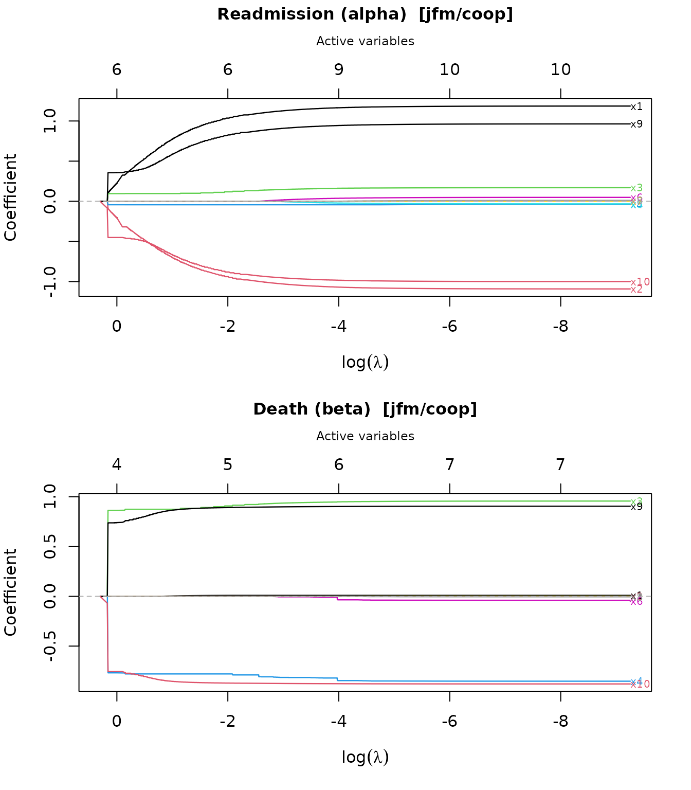
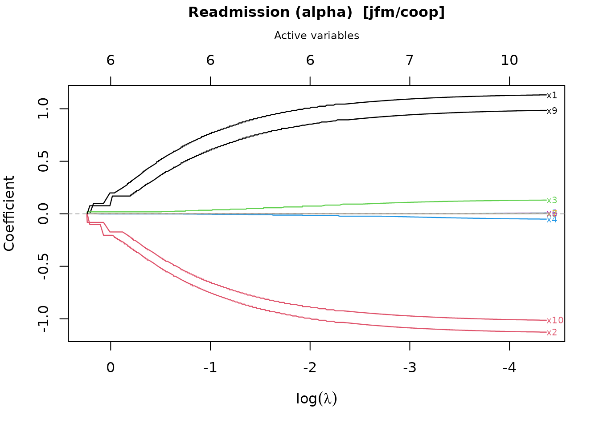
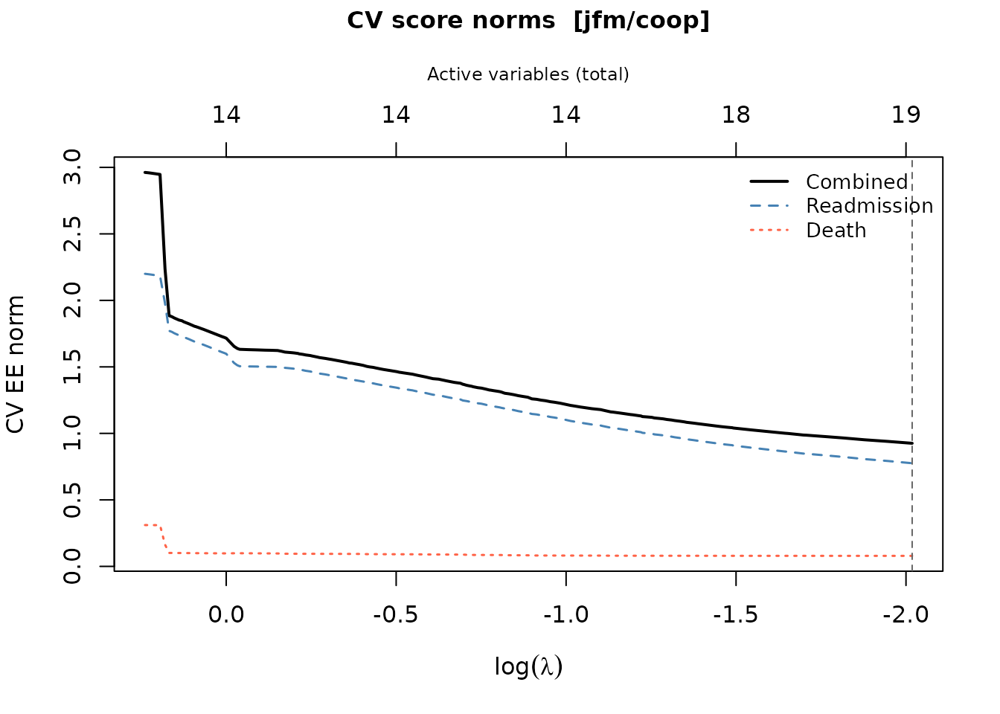
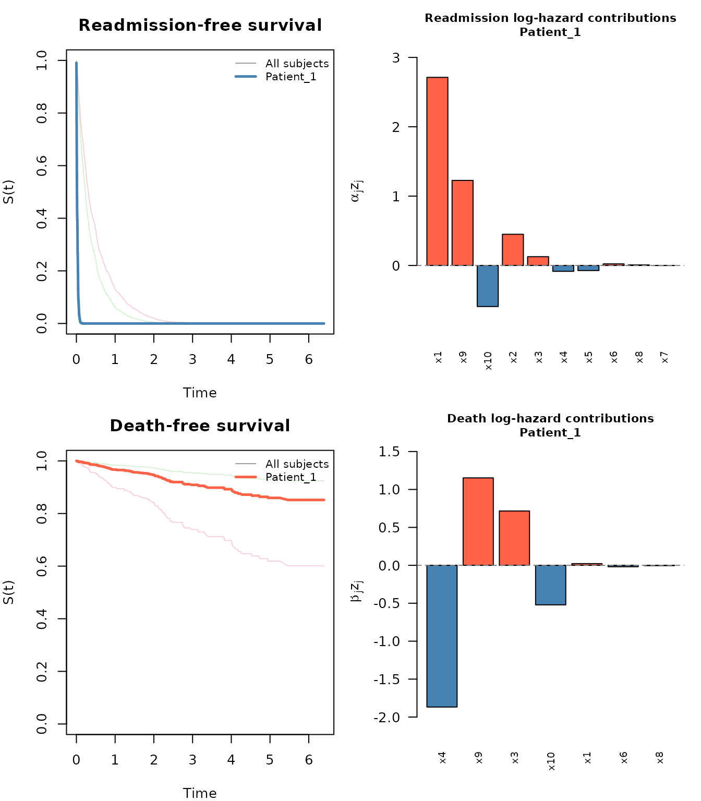
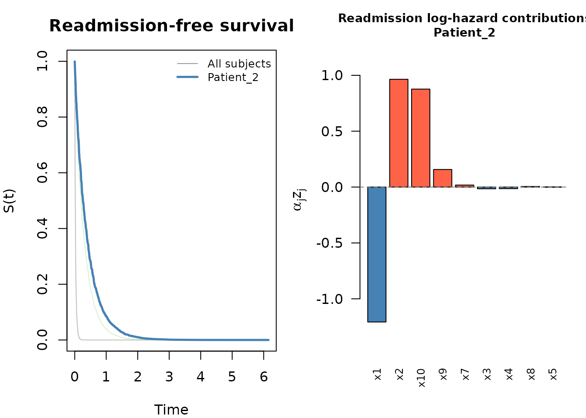
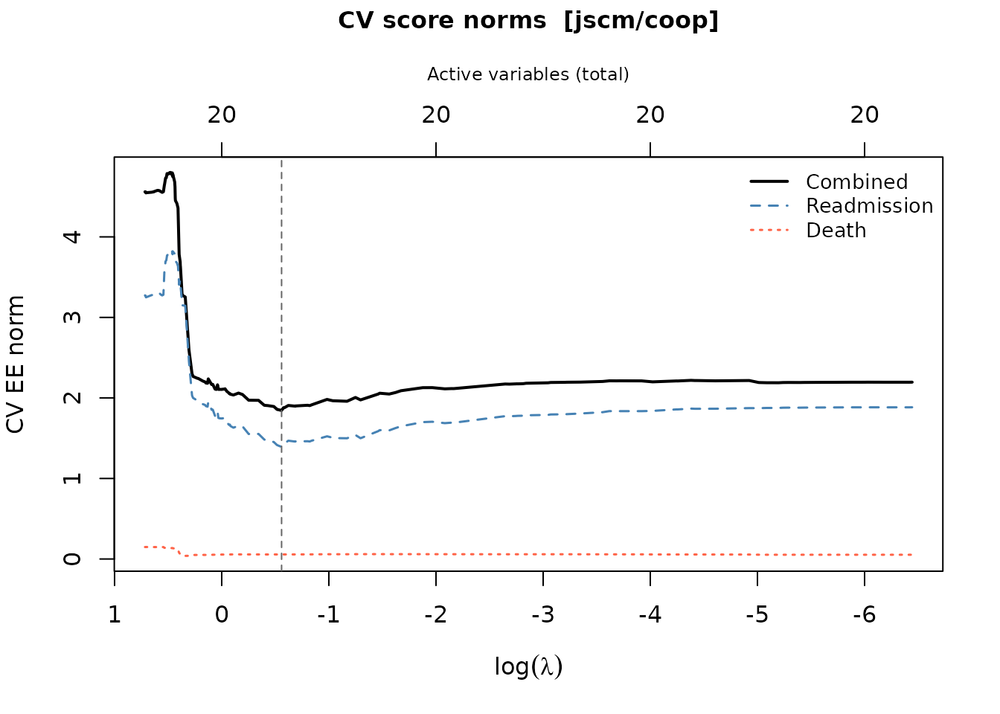
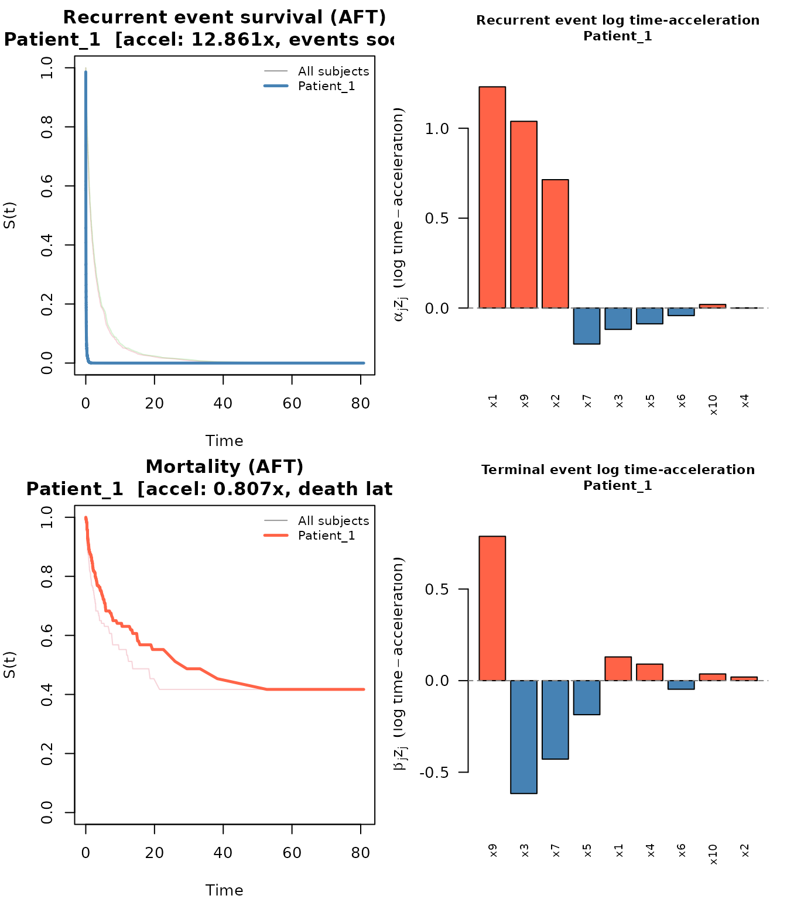
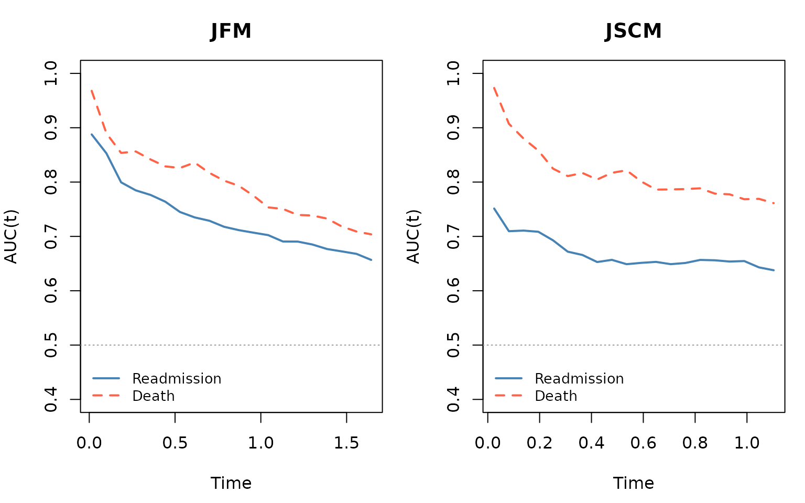

# Stagewise Variable Selection for Joint Semi-Competing Risk Models

## Overview

The `swjm` package implements **stagewise variable selection for joint
models of semi-competing risks**. In many medical settings — such as
hospital readmission following discharge — patients can experience a
*non-terminal* recurrent event (readmission) and a *terminal* event
(death). Death precludes future readmissions, but readmission does not
preclude death, a structure known as **semi-competing risks**.

Two joint model frameworks are supported:

| Model | Type | Recurrence process | Terminal process |
|----|----|----|----|
| **JFM** | Joint Frailty Model (Cox) | Proportional hazards | Proportional hazards |
| **JSCM** | Joint Scale-Change Model (AFT) | Rank-based estimating equations | Rank-based estimating equations |

Three penalty types are available: **cooperative lasso** (`"coop"`),
**lasso** (`"lasso"`), and **group lasso** (`"group"`). The cooperative
lasso is the recommended default; it encourages predictors that affect
both outcomes to enter together with the same sign.

------------------------------------------------------------------------

## 1. Statistical Background

### 1.1 Semi-Competing Risks

Let $`N_i^R(t)`$ count the readmission events for subject $`i`$ by time
$`t`$, and let $`T_i^D`$ denote the time to death. Death censors future
readmissions; readmission does not censor death.

Each subject $`i`$ ($`i = 1, \ldots, n`$) has:

- A $`p`$-dimensional covariate vector $`Z_i`$ (possibly time-varying).
- An observed follow-up interval $`[0, C_i]`$ where $`C_i`$ is the
  censoring time.

The parameter vector of interest is
``` math
\theta = (\alpha^\top, \beta^\top)^\top \in \mathbb{R}^{2p},
```
where $`\alpha \in \mathbb{R}^p`$ governs the recurrence (readmission)
process and $`\beta \in \mathbb{R}^p`$ governs the terminal (death)
process.

### 1.2 Joint Frailty Model (JFM)

The JFM (Kalbfleisch et al., 2013) introduces a subject-specific frailty
$`\omega_i \sim \text{Gamma}(\kappa, \kappa)`$ that links the two
processes:

``` math
\lambda^R(t \mid Z_i, \omega_i) = \lambda_0^R(t)\,
  e^{\alpha^\top Z_i(t)}\, \omega_i,
\qquad
\lambda^D(t \mid Z_i, \omega_i) = \lambda_0^D(t)\,
  e^{\beta^\top Z_i}\, \omega_i^\eta,
```

where $`\lambda_0^R`$ and $`\lambda_0^D`$ are unspecified baseline
hazard functions. Marginalising over $`\omega_i`$ yields estimating
equations that are functions only of $`(\alpha, \beta)`$ and the two
baseline hazards.

In the package, `alpha` is always the **readmission** coefficient vector
and `beta` is always the **death** coefficient vector.

### 1.3 Joint Scale-Change Model (JSCM)

The JSCM (Xu et al.) replaces proportional hazards with an AFT-type
scale-change specification:

``` math
\lambda^R(t \mid Z_i) = e^{\alpha^\top Z_i}\,
  \lambda_0^R(t\,e^{\alpha^\top Z_i}),
\qquad
\lambda^D(t \mid Z_i) = e^{\beta^\top Z_i}\,
  \lambda_0^D(t\,e^{\beta^\top Z_i}).
```

Estimation is based on rank-based estimating equations implemented in
C++ via RcppArmadillo.

### 1.4 Stagewise Variable Selection

The goal is to find a sparse $`\theta`$ that minimizes a penalized
estimating equation criterion. Three penalty structures are supported:

**Scaled lasso** (independent selection):
``` math
\text{pen}(\theta;\lambda) = \lambda \sum_{j=1}^p
  \left(\frac{|\alpha_j|}{s_\alpha} + \frac{|\beta_j|}{s_\beta}\right),
```

**Group lasso** (simultaneous entry of $`(\alpha_j, \beta_j)`$ pairs):
``` math
\text{pen}(\theta;\lambda) = \lambda \sum_{j=1}^p
  \left\|\left(\frac{\alpha_j}{s_\alpha}, \frac{\beta_j}{s_\beta}\right)\right\|_2,
```

**Cooperative lasso** (encourages shared sign and support):
``` math
\text{pen}(\theta;\lambda) = \lambda \sum_{j=1}^p
\begin{cases}
  \left\|\left(\frac{\alpha_j}{s_\alpha},
    \frac{\beta_j}{s_\beta}\right)\right\|_2
    & \text{if } \text{sgn}(\alpha_j) = \text{sgn}(\beta_j), \\[6pt]
  \left\|\left(\frac{\alpha_j}{s_\alpha},
    \frac{\beta_j}{s_\beta}\right)\right\|_\infty
    & \text{if } \text{sgn}(\alpha_j) \ne \text{sgn}(\beta_j).
\end{cases}
```

The cooperative lasso uses the L2 norm when both coefficients agree in
sign (rewarding variables that affect both outcomes in the same
direction) and the L-infinity norm when they disagree (applying a
harsher penalty).

The stagewise algorithm approximates the penalized solution by taking
small gradient steps in the direction determined by the dual norm of the
current estimating equation score. At each iteration:

1.  **Compute the EE score** $`U(\theta)`$ (gradient of the unpenalized
    estimating equation objective).
2.  **Find the active coordinate(s)** with the largest penalized dual
    norm.
3.  **Update** $`\theta`$ by a small step $`\epsilon`$ in that
    direction.

The regularization path is indexed by $`\lambda`$, recorded as the dual
norm at each step. Cross-validation over a grid of $`\lambda`$ values
selects the optimal tuning parameter.

### 1.5 Cross-Validation

[`cv_stagewise()`](http://jaredhuling.org/swjm/reference/cv_stagewise.md)
performs stratified K-fold cross-validation. For each fold, it evaluates
the cross-fitted EE score norm — the score from the held-out fold
evaluated at the coefficient fit from the remaining folds. The optimal
$`\lambda`$ minimizes the total cross-fitted norm across both
sub-models.

------------------------------------------------------------------------

## 2. Installation

``` r

# From the package source directory:
devtools::install("swjm")

# Or from a built tarball:
install.packages("swjm_0.1.0.tar.gz", repos = NULL, type = "source")
```

------------------------------------------------------------------------

## 3. Data Format

All functions expect a **data frame in counting-process (interval)
format** with the following required columns:

| Column      | Description                                                |
|-------------|------------------------------------------------------------|
| `id`        | Subject identifier                                         |
| `t.start`   | Interval start time                                        |
| `t.stop`    | Interval end time                                          |
| `event`     | 1 = readmission (recurrent event), 0 = death/censoring row |
| `status`    | 1 = death, 0 = alive/censored                              |
| `x1, …, xp` | Covariate columns                                          |

Each subject contributes multiple rows:

- One row per readmission interval (with `event = 1`), followed by
- One terminal row (with `event = 0`) recording either death
  (`status = 1`) or censoring (`status = 0`).

The covariate values may differ across rows for the same subject (JFM
supports time-varying covariates; JSCM uses the baseline values from the
`event = 0` rows).

------------------------------------------------------------------------

## 4. Simulating Data

[`generate_data()`](http://jaredhuling.org/swjm/reference/generate_data.md)
is a unified data-generation interface for both models.

``` r

library(swjm)
```

### 4.1 Joint Frailty Model data

``` r

set.seed(123)
dat_jfm  <- generate_data(n = 500, p = 10, scenario = 1, model = "jfm")
Data_jfm <- dat_jfm$data

# Preview
head(Data_jfm[, 1:8])
#>   id   t.start    t.stop event status         x1          x2         x3
#> 1  1 0.0000000 0.1847740     1      0 -0.3756029 -0.56187636 -0.3439172
#> 2  1 0.1847740 2.5816764     0      0 -0.4898705  0.04715443  1.3001987
#> 3  2 0.0000000 0.2965848     1      0  0.6843094 -1.39527435  0.8496430
#> 4  2 0.2965848 1.6792116     1      0 -0.2656516  0.11814451  0.1340386
#> 5  2 1.6792116 1.7574405     1      0  2.0024827  0.06670087  1.8668518
#> 6  2 1.7574405 1.8132809     1      0  0.3311792 -2.01421050  0.2119804
```

JFM: 500 subjects, 1513 rows, 1013 readmissions, 104 deaths

The returned list also contains the true generating coefficients:

True alpha (readmission):

``` r

round(dat_jfm$alpha_true, 2)
#>  [1]  1.1 -1.1  0.1 -0.1  0.0  0.0  0.0  0.0  1.0 -1.0
```

True beta (death):

``` r

round(dat_jfm$beta_true, 2)
#>  [1]  0.1 -0.1  1.1 -1.1  0.0  0.0  0.0  0.0  1.0 -1.0
```

**Scenario descriptions** (for both JFM and JSCM):

| Scenario | Signal structure |
|----|----|
| 1 | Variables affecting readmission only, death only, and both processes |
| 2 | Larger block of shared-sign signals |
| 3 | Mixed-sign signals (some variables have opposite effects on the two outcomes) |

### 4.2 Joint Scale-Change Model data

``` r

set.seed(456)
dat_jscm  <- generate_data(n = 500, p = 10, scenario = 1, model = "jscm")
#> Call: 
#> reReg::simGSC(n = n, summary = TRUE, para = para, xmat = X, censoring = C, 
#>     frailty = gamma, tau = 60)
#> 
#> Summary:
#> Sample size:                                    500 
#> Number of recurrent event observed:             937 
#> Average number of recurrent event per subject:  1.874 
#> Proportion of subjects with a terminal event:   0.212
Data_jscm <- dat_jscm$data
```

JSCM: 500 subjects, 1437 rows, 937 readmissions, 106 deaths

For the JSCM, covariates are drawn from $`\text{Uniform}(-1, 1)`$, and a
gamma frailty ($`\text{shape} = 4`$, $`\text{scale} = 0.25`$) is used in
simulation. Censoring times are $`\text{Uniform}(0, 4)`$.

------------------------------------------------------------------------

## 5. Joint Frailty Model (JFM) Workflow

### 5.1 Fit the Stagewise Regularization Path

[`stagewise_fit()`](http://jaredhuling.org/swjm/reference/stagewise_fit.md)
traces the full coefficient path as $`\lambda`$ decreases from a large
value (all coefficients zero) to a small value (many active variables):

``` r

fit_jfm <- stagewise_fit(
  Data_jfm,
  model   = "jfm",
  penalty = "coop"    # cooperative lasso
)
fit_jfm
#> Stagewise path (jfm/coop)
#> 
#>   Covariates (p):            10
#>   Iterations:                5000
#>   Lambda range:              [1, 1.27]
#>   Active at final step:      6 readmission, 5 death
#>     Readmission (alpha): 1, 2, 3, 4, 9, 10
#>     Death (beta):        1, 3, 4, 9, 10
```

The returned `swjm_path` object contains:

| Component | Description |
|----|----|
| `alpha` | $`p \times (k+1)`$ matrix of readmission coefficients along the path |
| `beta` | $`p \times (k+1)`$ matrix of death coefficients along the path |
| `theta` | $`2p \times (k+1)`$ combined matrix (`rbind(alpha, beta)`) |
| `lambda` | Dual norm at each step (regularization path index) |
| `model` | `"jfm"` or `"jscm"` |
| `penalty` | `"coop"`, `"lasso"`, or `"group"` |
| `p` | Number of covariates |

### 5.2 Explore the Regularization Path

``` r

p <- 10
k <- ncol(fit_jfm$alpha)
active_final <- which(fit_jfm$alpha[, k] != 0 |
                      fit_jfm$beta[, k]  != 0)
```

- Path length: 5001 steps
- Lambda range: \[1, 1.27\]
- Active variables at final step: 1 2 3 4 9 10

Readmission (alpha) coefficients at the final step:

``` r

round(fit_jfm$alpha[, k], 4)
#>  [1]  0.1442 -0.1739  0.0092 -0.0015  0.0000  0.0000  0.0000  0.0000  0.0779
#> [10] -0.1146
```

[`summary()`](https://rdrr.io/r/base/summary.html) shows a compact table
of path-end coefficients annotated with variable type (shared,
readmission-only, or death-only):

``` r

summary(fit_jfm)
#> Stagewise path (jfm/coop)
#> 
#>   p = 10  |  5000 iterations  |  lambda: [1, 1.27]
#>   Decreasing path: 611 steps
#> 
#>   Path-end coefficients (nonzero variables):
#> 
#>   Variable    alpha       beta        Type
#>   ----------  ----------  ----------  ----------------
#>   x10         -0.1146     -0.3948     shared (+)
#>   x3          +0.0092     +0.2888     shared (+)
#>   x2          -0.1739          —    readmission only
#>   x9          +0.0779     +0.3497     shared (+)
#>   x1          +0.1442     +0.0615     shared (+)
#>   x4          -0.0015     -0.7624     shared (+)
#> 
#>   Inactive: x5, x6, x7, x8
```

### 5.3 Plot the Coefficient Path

[`plot()`](https://rdrr.io/r/graphics/plot.default.html) produces a
glmnet-style coefficient trajectory plot. Two panels are drawn by
default — one for readmission ($`\alpha`$) and one for death ($`\beta`$)
— with the number of active variables on the top axis.

``` r

plot(fit_jfm)
```



To plot only one sub-model:

``` r

plot(fit_jfm, which = "readmission")
```



### 5.4 Cross-Validation

[`cv_stagewise()`](http://jaredhuling.org/swjm/reference/cv_stagewise.md)
selects the optimal $`\lambda`$ by K-fold cross-validation using
cross-fitted EE score norms.

It is good practice to restrict the $`\lambda`$ grid to the **strictly
decreasing** portion of the path (using
[`extract_decreasing_indices()`](http://jaredhuling.org/swjm/reference/extract_decreasing_indices.md)):

``` r

lambda_path <- fit_jfm$lambda
dec_idx     <- swjm:::extract_decreasing_indices(lambda_path)
lambda_seq  <- lambda_path[dec_idx]
```

Full path: 5001 steps; decreasing path: 611 steps

``` r

set.seed(1)
cv_jfm <- cv_stagewise(
  Data_jfm,
  model      = "jfm",
  penalty    = "coop",
  lambda_seq = lambda_seq,
  K          = 3L
)
cv_jfm
#> Cross-validation (jfm/coop)
#> 
#>   Covariates (p):              10
#>   Lambda grid size:            611
#>   Best position (combined):    611  (lambda = 1)
#>   Selected variables:          6 readmission, 5 death
#>     Readmission (alpha): 1, 2, 3, 4, 9, 10
#>     Death (beta):        1, 3, 4, 9, 10
```

The returned `swjm_cv` object contains:

| Component | Description |
|----|----|
| `alpha` | Readmission coefficients at the optimal $`\lambda`$ |
| `beta` | Death coefficients at the optimal $`\lambda`$ |
| `position_CF` | Index of optimal $`\lambda`$ in `lambda_seq` |
| `lambda_seq` | The $`\lambda`$ grid used for cross-validation |
| `Scorenorm_crossfit` | Combined cross-fitted EE norm over the grid |
| `Scorenorm_crossfit_re` | Readmission component |
| `Scorenorm_crossfit_ce` | Death component |
| `n_active_alpha` | Number of active readmission variables per $`\lambda`$ |
| `n_active_beta` | Number of active death variables per $`\lambda`$ |
| `n_active` | Total active variables |
| `baseline` | Cumulative baseline hazards (Breslow for JFM; Nelson-Aalen on accelerated scale for JSCM) |

The optimal $`\lambda`$ is `cv_jfm$lambda_seq[cv_jfm$position_CF]`.

### 5.5 Plot the CV Results

``` r

plot(cv_jfm)
```



The plot shows three curves: the combined norm (black, solid), the
readmission component (blue, dashed), and the death component (red,
dotted). The vertical dashed line marks the optimal $`\lambda`$.

### 5.6 Extract Coefficients and Summarize

Selected readmission (alpha) variables: 1 2 3 4 9 10

Selected death (beta) variables: 1 3 4 9 10

Nonzero alpha:

``` r

round(cv_jfm$alpha[cv_jfm$alpha != 0], 4)
#> [1]  0.1432 -0.1728  0.0073 -0.0003  0.0756 -0.1043
```

Nonzero beta:

``` r

round(cv_jfm$beta[cv_jfm$beta != 0], 4)
#> [1]  0.0612  0.2329 -0.1233  0.3414 -0.3639
```

[`summary()`](https://rdrr.io/r/base/summary.html) shows a formatted
table with the CV-optimal coefficients:

``` r

summary(cv_jfm)
#> CV-selected model (jfm/coop)
#> 
#>   p = 10  |  Lambda grid: 611 steps  |  CV optimal: step 611 (lambda = 1)
#> 
#>   Selected coefficients  (6 readmission, 5 death):
#> 
#>   Variable    alpha       beta        Type
#>   ----------  ----------  ----------  ----------------
#>   x10         -0.1043     -0.3639     shared (+)
#>   x9          +0.0756     +0.3414     shared (+)
#>   x3          +0.0073     +0.2329     shared (+)
#>   x1          +0.1432     +0.0612     shared (+)
#>   x2          -0.1728          —    readmission only
#>   x4          -0.0003     -0.1233     shared (+)
#> 
#>   Inactive (4): x5, x6, x7, x8
```

[`coef()`](https://rdrr.io/r/stats/coef.html) returns the combined
$`2p`$-vector `c(alpha, beta)` for programmatic use:

``` r

theta_best <- coef(cv_jfm)
length(theta_best)  # 2p
#> [1] 20
```

### 5.7 Baseline Hazard

[`baseline_hazard()`](http://jaredhuling.org/swjm/reference/baseline_hazard.md)
evaluates the cumulative baseline hazards at specified time points. For
JFM, Breslow-type estimators are used:

``` r

bh <- baseline_hazard(cv_jfm, times = c(0.5, 1.0, 2.0, 4.0, 6.0))
print(bh)
#>   time cumhaz_readmission cumhaz_death
#> 1  0.5           0.864854   0.06280522
#> 2  1.0           1.288666   0.09811808
#> 3  2.0           1.919539   0.19350963
#> 4  4.0           2.752144   0.30751397
#> 5  6.0           3.313761   0.39696802
```

To retrieve only one of the two processes:

``` r

bh_re <- baseline_hazard(cv_jfm, times = seq(0, 5, by = 0.5),
                         which = "readmission")
head(bh_re)
#>   time cumhaz_readmission
#> 1  0.0           0.000000
#> 2  0.5           0.864854
#> 3  1.0           1.288666
#> 4  1.5           1.642736
#> 5  2.0           1.919539
#> 6  2.5           2.157865
```

### 5.8 Survival Prediction

[`predict()`](https://rdrr.io/r/stats/predict.html) computes
subject-specific survival curves for both readmission and death. For
JFM, Breslow cumulative baseline hazards are used:
``` math
S_{\text{re}}(t \mid z) = \exp\!\bigl(-\hat\Lambda_0^r(t)\,
  e^{\hat\alpha^\top z}\bigr), \qquad
S_{\text{de}}(t \mid z) = \exp\!\bigl(-\hat\Lambda_0^d(t)\,
  e^{\hat\beta^\top z}\bigr).
```
For JSCM, Nelson-Aalen baselines on the accelerated time scale are used
(see Section 7.5).

``` r

set.seed(7)
newz <- matrix(rnorm(30), nrow = 12, ncol = 10)
rownames(newz) <- paste0("Patient_", 1:12)
colnames(newz) <- paste0("x", 1:10)

pred <- predict(cv_jfm, newdata = newz)
pred
#> swjm predictions (jfm)
#> 
#>   Subjects:                12
#>   Time points:             1117
#>   Time range:              [8.134e-05, 6.153]
#> 
#>   Use plot() to visualize survival curves and predictor contributions.
```

The `swjm_pred` object contains:

- `S_re`: readmission-free survival matrix (subjects × time points)
- `S_de`: death-free survival matrix
- `lp_re`: linear predictors $`\hat\alpha^\top z_i`$
- `lp_de`: linear predictors $`\hat\beta^\top z_i`$
- `contrib_re`, `contrib_de`: per-predictor contributions
  $`\hat\alpha_j z_{ij}`$

``` r

# Survival probabilities for all subjects at first few time points
round(pred$S_re[, 1:5], 3)
#>            t=8.134e-05 t=0.0002363 t=0.0002812 t=0.0003871 t=0.0006399
#> Patient_1        0.998       0.998       0.996       0.994       0.993
#> Patient_2        0.999       0.999       0.997       0.996       0.995
#> Patient_3        0.999       0.999       0.998       0.997       0.995
#> Patient_4        0.998       0.998       0.996       0.995       0.993
#> Patient_5        0.998       0.998       0.997       0.995       0.993
#> Patient_6        0.998       0.998       0.995       0.993       0.990
#> Patient_7        0.998       0.998       0.996       0.993       0.991
#> Patient_8        0.998       0.998       0.997       0.995       0.994
#> Patient_9        0.998       0.998       0.996       0.995       0.993
#> Patient_10       0.998       0.998       0.996       0.993       0.991
#> Patient_11       0.998       0.998       0.997       0.995       0.994
#> Patient_12       0.996       0.996       0.993       0.989       0.986
```

[`plot()`](https://rdrr.io/r/graphics/plot.default.html) on a
`swjm_pred` object produces a four-panel figure: survival curves for
both processes (all subjects in grey, highlighted subject in color) plus
bar charts of predictor contributions:

``` r

plot(pred, which_subject = 7)
```



To focus on only one process:

``` r

plot(pred, which_subject = 2, which_process = "readmission")
```



------------------------------------------------------------------------

## 6. Other Penalty Types (JFM)

All three penalties are available for both models. Here we illustrate
the lasso and group lasso on the JFM data.

### 6.1 Lasso

The lasso penalizes each coordinate independently. It allows variables
to enter the readmission path without entering the death path (and vice
versa):

``` r

fit_lasso <- stagewise_fit(Data_jfm, model = "jfm", penalty = "lasso")
set.seed(2)
cv_lasso <- cv_stagewise(Data_jfm, model = "jfm", penalty = "lasso", K = 3L)
summary(cv_lasso)
```

### 6.2 Group Lasso

The group lasso treats $`(\alpha_j, \beta_j)`$ pairs as groups; a
variable enters (or leaves) both sub-models simultaneously:

``` r

fit_group <- stagewise_fit(Data_jfm, model = "jfm", penalty = "group")
set.seed(3)
cv_group <- cv_stagewise(Data_jfm, model = "jfm", penalty = "group", K = 3L)
summary(cv_group)
```

### 6.3 Comparing Penalties

The cooperative lasso typically achieves better variable selection than
the standard lasso when the true signal is sparse and shared between
outcomes. The group lasso is a good alternative when you expect all
relevant predictors to affect both outcomes with comparable magnitude.

------------------------------------------------------------------------

## 7. Joint Scale-Change Model (JSCM) Workflow

The JSCM workflow mirrors the JFM workflow with two differences:

- The default step size is smaller (`eps = 0.01`) and more iterations
  are needed (`max_iter = 5000`).
- The EE is rank-based (implemented in C++ via RcppArmadillo).
- Survival curves are computed via a **Nelson-Aalen estimator on the
  accelerated time scale**. For subject $`i`$ with linear predictor
  $`\hat\alpha^\top z_i`$, the recurrence survival function is
  $`S_{\text{re}}(t \mid z_i) = \exp\!\bigl(-\hat\Lambda_0^r(t\,
  e^{\hat\alpha^\top z_i})\bigr)`$, where $`\hat\Lambda_0^r`$ is
  estimated by pooling all accelerated event times
  $`t_{ij}\,e^{\hat\alpha^\top z_i}`$.

### 7.1 Fit the Stagewise Path

``` r

set.seed(456)
dat_jscm  <- generate_data(n = 500, p = 10, scenario = 1, model = "jscm")
#> Call: 
#> reReg::simGSC(n = n, summary = TRUE, para = para, xmat = X, censoring = C, 
#>     frailty = gamma, tau = 60)
#> 
#> Summary:
#> Sample size:                                    500 
#> Number of recurrent event observed:             937 
#> Average number of recurrent event per subject:  1.874 
#> Proportion of subjects with a terminal event:   0.212
Data_jscm <- dat_jscm$data

fit_jscm <- stagewise_fit(Data_jscm, model = "jscm", penalty = "coop")
fit_jscm
#> Stagewise path (jscm/coop)
#> 
#>   Covariates (p):            10
#>   Iterations:                5000
#>   Lambda range:              [0.1005, 2.143]
#>   Active at final step:      10 readmission, 9 death
#>     Readmission (alpha): 1, 2, 3, 4, 5, 6, 7, 8, 9, 10
#>     Death (beta):        1, 2, 3, 4, 5, 6, 7, 9, 10
```

### 7.2 Cross-Validation

``` r

lambda_path_jscm <- fit_jscm$lambda
dec_idx_jscm     <- swjm:::extract_decreasing_indices(lambda_path_jscm)
lambda_seq_jscm  <- lambda_path_jscm[dec_idx_jscm]

set.seed(10)
cv_jscm <- cv_stagewise(
  Data_jscm,
  model      = "jscm",
  penalty    = "coop",
  lambda_seq = lambda_seq_jscm,
  K          = 3L
)
cv_jscm
#> Cross-validation (jscm/coop)
#> 
#>   Covariates (p):              10
#>   Lambda grid size:            314
#>   Best position (combined):    278  (lambda = 0.2825)
#>   Selected variables:          9 readmission, 9 death
#>     Readmission (alpha): 1, 2, 3, 4, 5, 6, 7, 9, 10
#>     Death (beta):        1, 2, 3, 4, 5, 6, 7, 9, 10
```

### 7.3 Results

Selected alpha (readmission): 1 2 3 4 5 6 7 9 10

Selected beta (death): 1 2 3 4 5 6 7 9 10

True nonzero alpha: 1 2 3 4 9 10

True nonzero beta: 1 2 3 4 9 10

``` r

plot(cv_jscm)
```



``` r

summary(cv_jscm)
#> CV-selected model (jscm/coop)
#> 
#>   p = 10  |  Lambda grid: 314 steps  |  CV optimal: step 278 (lambda = 0.2825)
#> 
#>   Selected coefficients  (9 readmission, 9 death):
#> 
#>   Variable    alpha       beta        Type
#>   ----------  ----------  ----------  ----------------
#>   x10         -1.0355     -1.9168     shared (+)
#>   x3          +0.3709     +1.9266     shared (+)
#>   x9          +1.0624     +0.8060     shared (+)
#>   x1          +1.2583     +0.1323     shared (+)
#>   x4          -0.0027     -1.1036     shared (+)
#>   x2          -0.8297     -0.0229     shared (+)
#>   x7          -0.2060     -0.4410     shared (+)
#>   x5          -0.1610     -0.3408     shared (+)
#>   x6          +0.0506     +0.0565     shared (+)
#> 
#>   Inactive (1): x8
```

### 7.4 Baseline Hazard (JSCM)

[`baseline_hazard()`](http://jaredhuling.org/swjm/reference/baseline_hazard.md)
works for the JSCM as well. The baseline is estimated via Nelson-Aalen
on the accelerated time scale: each subject’s event times are multiplied
by their acceleration factor $`e^{\hat\alpha^\top z_i}`$ before pooling,
so the resulting $`\hat\Lambda_0^r`$ is on the common (baseline) time
scale.

``` r

bh_jscm <- baseline_hazard(cv_jscm, times = c(0.5, 1.0, 2.0, 3.0, 4.0))
print(bh_jscm)
#>   time cumhaz_readmission cumhaz_death
#> 1  0.5          0.7764333    0.0813419
#> 2  1.0          1.2969592    0.1295158
#> 3  2.0          2.1218172    0.2061035
#> 4  3.0          2.7536773    0.2634039
#> 5  4.0          3.1578858    0.3174247
```

### 7.5 Survival Prediction and AFT Interpretation

[`predict()`](https://rdrr.io/r/stats/predict.html) returns
subject-specific survival curves for both processes via:
``` math
S_{\text{re}}(t \mid z_i) = \exp\!\bigl(-\hat\Lambda_0^r(t\,e^{\hat\alpha^\top z_i})\bigr),
\qquad
S_{\text{de}}(t \mid z_i) = \exp\!\bigl(-\hat\Lambda_0^d(t\,e^{\hat\beta^\top z_i})\bigr).
```

The linear predictor $`\hat\alpha^\top z_i`$ is a **log
time-acceleration factor**: $`e^{\hat\alpha^\top z_i} > 1`$ means events
are expected sooner than baseline; $`< 1`$ means later. Each term
$`e^{\hat\alpha_j z_{ij}}`$ is the multiplicative contribution of
predictor $`j`$:

| Value of $`e^{\hat\alpha_j z_{ij}}`$ | Interpretation |
|----|----|
| $`> 1`$ | predictor $`j`$ accelerates events — shorter time to readmission |
| $`= 1`$ | no effect on this subject’s timing |
| $`< 1`$ | predictor $`j`$ decelerates events — longer time to readmission |

``` r

set.seed(7)
newz_jscm <- matrix(runif(30, -1, 1), nrow = 3, ncol = 10)
rownames(newz_jscm) <- paste0("Patient_", 1:3)

pred_jscm <- predict(cv_jscm, newdata = newz_jscm)
pred_jscm
#> swjm predictions (jscm)
#> 
#>   Subjects:                3
#>   Time points:             1043
#>   Time range:              [0.0005034, 80.88]
#> 
#>   Time-acceleration factors (exp(alpha^T z) for recurrence):
#> Patient_1 Patient_2 Patient_3 
#>   12.8613    0.3113    0.2908 
#> 
#>   Time-acceleration factors (exp(beta^T z) for death):
#> Patient_1 Patient_2 Patient_3 
#>    0.8075    1.5937    0.7996 
#> 
#>   Use plot() to visualize survival curves and predictor contributions.
```

Recurrence time-acceleration factors (total per subject):

``` r

round(pred_jscm$time_accel_re, 3)
#> Patient_1 Patient_2 Patient_3 
#>    12.861     0.311     0.291
```

[`plot()`](https://rdrr.io/r/graphics/plot.default.html) produces the
same four-panel layout as for the JFM: survival curves for both
processes (all subjects in grey, highlighted subject in color) plus bar
charts of log time-acceleration contributions. The survival panel titles
show each subject’s total acceleration factor.

``` r

plot(pred_jscm, which_subject = 1)
```



------------------------------------------------------------------------

## 8. Interpreting Output

### 8.1 Alpha and Beta Conventions

In both JFM and JSCM, `alpha` governs the recurrence (readmission)
process and `beta` governs the terminal (death) process. The
interpretation of the coefficients differs by model:

**JFM (proportional hazards):**

- `alpha[j] > 0`: covariate $`j`$ increases the recurrence hazard — more
  frequent readmissions for higher values of $`x_j`$.
- `beta[j] > 0`: covariate $`j`$ increases the death hazard.
- The subject-specific contribution $`\hat\alpha_j z_{ij}`$ is an
  additive log-hazard-ratio contribution. Positive = higher risk;
  negative = lower risk.

**JSCM (scale-change / AFT-type):**

- `alpha[j] > 0`: covariate $`j`$ accelerates the recurrence process —
  events happen sooner for higher values of $`x_j`$.
- `beta[j] > 0`: covariate $`j`$ accelerates the terminal process.
- The subject-specific contribution $`\hat\alpha_j z_{ij}`$ is an
  additive **log time-acceleration** contribution. Exponentiating gives
  the multiplicative factor on the time scale:
  $`e^{\hat\alpha_j z_{ij}} > 1`$ means shorter event times
  (acceleration); $`< 1`$ means longer times (deceleration).

The combined coefficient vector `coef(cv)` returns `c(alpha, beta)`, the
first $`p`$ elements being readmission and the last $`p`$ being death.

### 8.2 Cooperative Lasso and Variable Grouping

The cooperative lasso categorizes selected variables into groups:

| Pattern | Interpretation |
|----|----|
| `alpha[j] != 0`, `beta[j] == 0` | Readmission-only predictor |
| `alpha[j] == 0`, `beta[j] != 0` | Death-only predictor |
| `alpha[j] != 0`, `beta[j] != 0`, same sign | Shared predictor (cooperating) |
| `alpha[j] != 0`, `beta[j] != 0`, opposite sign | Shared predictor (competing) |

Variables with the same nonzero sign in both $`\alpha`$ and $`\beta`$
indicate factors that simultaneously increase risk for both readmission
and death — clinically meaningful when seeking joint risk factors.

``` r

a <- cv_jfm$alpha
b <- cv_jfm$beta

nz_a <- which(a != 0)
nz_b <- which(b != 0)
shared <- intersect(nz_a, nz_b)

same_sign <- if (length(shared) > 0) shared[sign(a[shared]) == sign(b[shared])] else integer(0)
opp_sign  <- if (length(shared) > 0) shared[sign(a[shared]) != sign(b[shared])] else integer(0)
```

- Readmission-only: 2
- Death-only:
- Shared (same sign): 1, 3, 4, 9, 10
- Shared (opp. sign):

### 8.3 Survival Curve Interpretation

The survival curves from
[`predict()`](https://rdrr.io/r/stats/predict.html) answer:

- **`S_re(t | z)`**: probability that subject $`z`$ has not been
  readmitted by time $`t`$.
- **`S_de(t | z)`**: probability that subject $`z`$ has not died by time
  $`t`$.

For JFM these use Breslow cumulative baselines; for JSCM they use
Nelson-Aalen baselines on the accelerated time scale.

The predictor contribution matrices (`contrib_re`, `contrib_de`) show
the additive contribution of each covariate to the log-hazard (JFM) or
log time-acceleration (JSCM) for that subject. For JFM, positive
contributions increase risk; negative reduce it. For JSCM, positive
contributions accelerate events; negative decelerate them.

``` r

c1_re <- pred$contrib_re[1, ]
c1_de <- pred$contrib_de[1, ]
```

Readmission log-hazard contributions for Patient_1 (nonzero):

``` r

round(c1_re[c1_re != 0], 4)
#>      x1      x2      x3      x4      x9     x10 
#>  0.3275 -0.3942  0.0093 -0.0002  0.0566  0.0005
```

Death log-hazard contributions for Patient_1 (nonzero):

``` r

round(c1_de[c1_de != 0], 4)
#>      x1      x3      x4      x9     x10 
#>  0.1399  0.2964 -0.0922  0.2554  0.0018
```

------------------------------------------------------------------------

## 9. Default Parameters

| Parameter | JFM default | JSCM default | Description |
|----|----|----|----|
| `eps` | 0.1 | 0.01 | Step size (smaller for JSCM for numerical stability) |
| `max_iter` | 5000 | 5000 | Maximum stagewise iterations |
| `pp` | `max_iter` | `max_iter` | Early-stopping window (checks every `pp` steps) |

Early stopping triggers when a single coordinate dominates every step in
the last `pp` iterations. Both models disable early stopping by default
(`pp = max_iter`) so that weaker true signals have time to accumulate
before the path terminates. Both models use `max_iter = 5000` by
default: for JSCM the small step size (`eps = 0.01`) requires many
iterations to accumulate coefficients, and for JFM a long path is needed
for the cross-validated score to reach its minimum within the path
rather than at the boundary.

------------------------------------------------------------------------

## 10. Model Evaluation

### 10.1 Coefficient Recovery

Compare CV-optimal estimates to the true generating coefficients.
Variables that are truly nonzero or were selected are shown; all others
were correctly excluded.

``` r

p <- 10

show_jfm <- sort(which(dat_jfm$alpha_true != 0 | cv_jfm$alpha != 0 |
                        dat_jfm$beta_true  != 0 | cv_jfm$beta  != 0))

coef_df <- data.frame(
  variable   = paste0("x", show_jfm),
  true_alpha = round(dat_jfm$alpha_true[show_jfm], 3),
  est_alpha  = round(cv_jfm$alpha[show_jfm],       3),
  true_beta  = round(dat_jfm$beta_true[show_jfm],  3),
  est_beta   = round(cv_jfm$beta[show_jfm],        3)
)
colnames(coef_df) <- c("variable", "alpha_true", "alpha_est",
                        "beta_true", "beta_est")
print(coef_df, row.names = FALSE)
#>  variable alpha_true alpha_est beta_true beta_est
#>        x1        1.1     0.143       0.1    0.061
#>        x2       -1.1    -0.173      -0.1    0.000
#>        x3        0.1     0.007       1.1    0.233
#>        x4       -0.1     0.000      -1.1   -0.123
#>        x9        1.0     0.076       1.0    0.341
#>       x10       -1.0    -0.104      -1.0   -0.364
```

JFM alpha: TP=6 FP=0 FN=0 \| beta: TP=5 FP=0 FN=1

``` r

show_jscm <- sort(which(dat_jscm$alpha_true != 0 | cv_jscm$alpha != 0 |
                         dat_jscm$beta_true  != 0 | cv_jscm$beta  != 0))

coef_jscm <- data.frame(
  variable   = paste0("x", show_jscm),
  true_alpha = round(dat_jscm$alpha_true[show_jscm], 3),
  est_alpha  = round(cv_jscm$alpha[show_jscm],        3),
  true_beta  = round(dat_jscm$beta_true[show_jscm],  3),
  est_beta   = round(cv_jscm$beta[show_jscm],         3)
)
colnames(coef_jscm) <- c("variable", "alpha_true", "alpha_est",
                          "beta_true", "beta_est")
print(coef_jscm, row.names = FALSE)
#>  variable alpha_true alpha_est beta_true beta_est
#>        x1        1.1     1.258       0.1    0.132
#>        x2       -1.1    -0.830      -0.1   -0.023
#>        x3        0.1     0.371       1.1    1.927
#>        x4       -0.1    -0.003      -1.1   -1.104
#>        x5        0.0    -0.161       0.0   -0.341
#>        x6        0.0     0.051       0.0    0.056
#>        x7        0.0    -0.206       0.0   -0.441
#>        x9        1.0     1.062       1.0    0.806
#>       x10       -1.0    -1.036      -1.0   -1.917
```

JSCM alpha: TP=6 FP=3 FN=0 \| beta: TP=6 FP=3 FN=0

### 10.2 Time-Varying AUC

We use the `timeROC` package (Blanche et al., 2013) to compute
cause-specific time-varying AUC in the competing-risk framework. Each
subject contributes at most a first-readmission event (cause 1) and a
death event (cause 2). Each sub-model is assessed with its own linear
predictor: $`\hat\alpha^\top z_i`$ for readmission,
$`\hat\beta^\top z_i`$ for death.

> **Note**: AUC is evaluated on the training data for illustration. In
> practice use held-out or cross-validated predictions.

``` r

# Construct competing-risk dataset:
# Keep first readmission (event==1 & t.start==0) + death/censor (event==0).
# Status: 1 = first readmission, 2 = death, 0 = censored.
.cr_data <- function(Data) {
  d3 <- Data[Data$event == 0 | (Data$event == 1 & Data$t.start == 0), ]
  d3 <- d3[order(d3$id, d3$t.start, d3$t.stop), ]
  status <- ifelse(d3$event == 1 & d3$status == 0, 1L,
             ifelse(d3$event == 0 & d3$status == 0, 0L, 2L))
  list(data = d3, status = status)
}

cr_jfm  <- .cr_data(Data_jfm)
cr_jscm <- .cr_data(Data_jscm)

# Baseline covariates (one row per subject)
Z_jfm  <- as.matrix(Data_jfm[!duplicated(Data_jfm$id),   paste0("x", 1:p)])
Z_jscm <- as.matrix(Data_jscm[!duplicated(Data_jscm$id), paste0("x", 1:p)])

# Markers expanded to row level: alpha^T z for readmission, beta^T z for death
M_re_jfm  <- drop(Z_jfm  %*% cv_jfm$alpha)[cr_jfm$data$id]
M_de_jfm  <- drop(Z_jfm  %*% cv_jfm$beta)[cr_jfm$data$id]
M_re_jscm <- drop(Z_jscm %*% cv_jscm$alpha)[cr_jscm$data$id]
M_de_jscm <- drop(Z_jscm %*% cv_jscm$beta)[cr_jscm$data$id]
```

``` r

library(survival)
library(timeROC)

# Evaluation grid: 20 points spanning the 10th-85th percentile of event times
.tgrid <- function(t_vec, status, n = 20) {
  t_ev <- t_vec[status > 0]
  seq(quantile(t_ev, 0.10), quantile(t_ev, 0.85), length.out = n)
}

t_jfm  <- .tgrid(cr_jfm$data$t.stop,  cr_jfm$status)
t_jscm <- .tgrid(cr_jscm$data$t.stop, cr_jscm$status)

# Readmission AUC: alpha^T z marker, cause = 1
roc_re_jfm <- timeROC(T = cr_jfm$data$t.stop, delta = cr_jfm$status,
                       marker = M_re_jfm, cause = 1, weighting = "marginal",
                       times = t_jfm, ROC = FALSE, iid = FALSE)
roc_re_jscm <- timeROC(T = cr_jscm$data$t.stop, delta = cr_jscm$status,
                        marker = M_re_jscm, cause = 1, weighting = "marginal",
                        times = t_jscm, ROC = FALSE, iid = FALSE)

# Death AUC: beta^T z marker, cause = 2
roc_de_jfm <- timeROC(T = cr_jfm$data$t.stop, delta = cr_jfm$status,
                       marker = M_de_jfm, cause = 2, weighting = "marginal",
                       times = t_jfm, ROC = FALSE, iid = FALSE)
roc_de_jscm <- timeROC(T = cr_jscm$data$t.stop, delta = cr_jscm$status,
                        marker = M_de_jscm, cause = 2, weighting = "marginal",
                        times = t_jscm, ROC = FALSE, iid = FALSE)
```

``` r

.get_auc <- function(roc, cause) {
  auc <- roc[[paste0("AUC_", cause)]]
  if (is.null(auc)) auc <- roc$AUC
  if (is.null(auc) || !is.numeric(auc)) return(rep(NA_real_, length(roc$times)))
  if (length(auc) == length(roc$times) + 1) auc <- auc[-1]
  as.numeric(auc)
}

old_par <- par(mfrow = c(1, 2), mar = c(4.5, 4, 3, 1))

plot(t_jfm, .get_auc(roc_re_jfm, 1), type = "l", lwd = 2, col = "steelblue",
     xlab = "Time", ylab = "AUC(t)", main = "JFM", ylim = c(0.4, 1))
lines(t_jfm, .get_auc(roc_de_jfm, 2), lwd = 2, col = "tomato", lty = 2)
abline(h = 0.5, lty = 3, col = "grey60")
legend("bottomleft", c("Readmission", "Death"),
       col = c("steelblue", "tomato"), lwd = 2, lty = c(1, 2),
       bty = "n", cex = 0.85)

plot(t_jscm, .get_auc(roc_re_jscm, 1), type = "l", lwd = 2, col = "steelblue",
     xlab = "Time", ylab = "AUC(t)", main = "JSCM", ylim = c(0.4, 1))
lines(t_jscm, .get_auc(roc_de_jscm, 2), lwd = 2, col = "tomato", lty = 2)
abline(h = 0.5, lty = 3, col = "grey60")
legend("bottomleft", c("Readmission", "Death"),
       col = c("steelblue", "tomato"), lwd = 2, lty = c(1, 2),
       bty = "n", cex = 0.85)
```



``` r


par(old_par)
```

------------------------------------------------------------------------

## 11. References

Blanche, P., Dartigues, J.-F., and Jacqmin-Gadda, H. (2013). Estimating
and comparing time-dependent areas under receiver operating
characteristic curves for censored event times with competing risks.
*Statistics in Medicine*, **32**(30), 5381–5397.

Kalbfleisch, J. D., Schaubel, D. E., Ye, Y., and Gong, Q. (2013). An
estimating function approach to the analysis of recurrent and terminal
events. *Biometrics*, **69**(2), 366–374.

Xu, G., Chiou, S. H., Huang, C.-Y., Wang, M.-C., and Yan, J. (2017).
Joint scale-change models for recurrent events and failure time.
*Journal of the American Statistical Association*, **112**(518),
794–805.

Huo, L., Jiang, Z., Hou, J., and Huling, J. D. (2025). A stagewise
selection framework for joint models for semi-competing risk prediction.
*Manuscript*.
