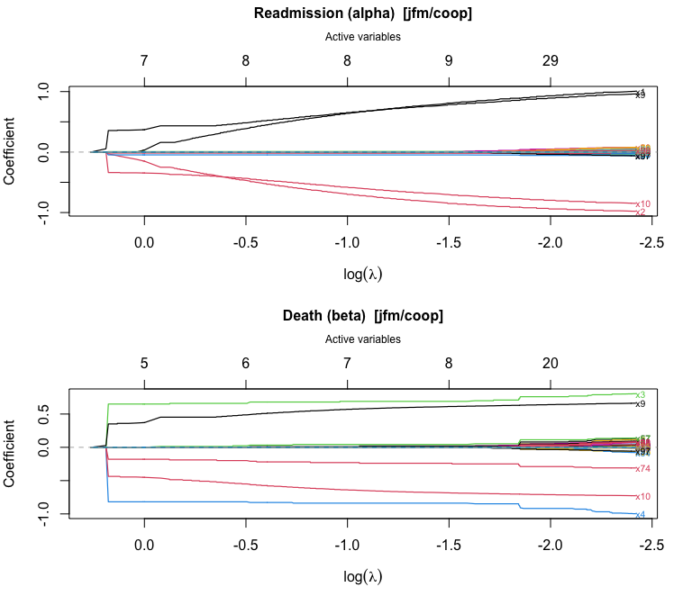
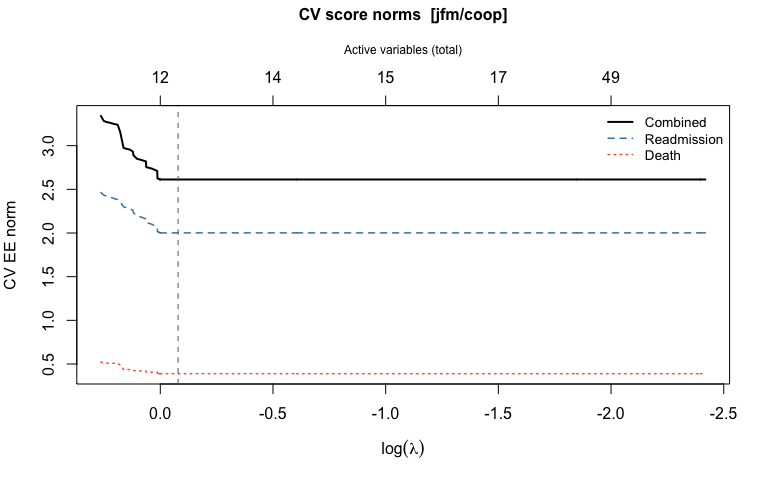
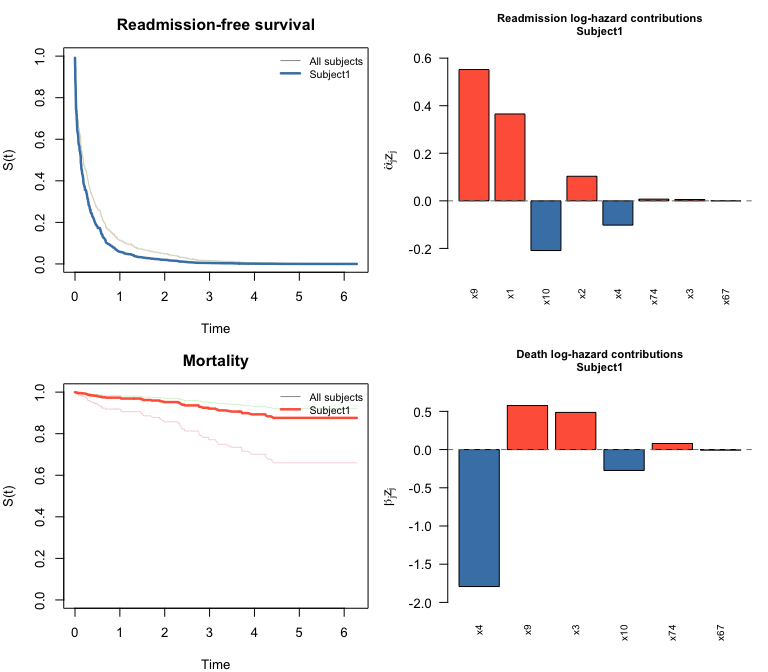
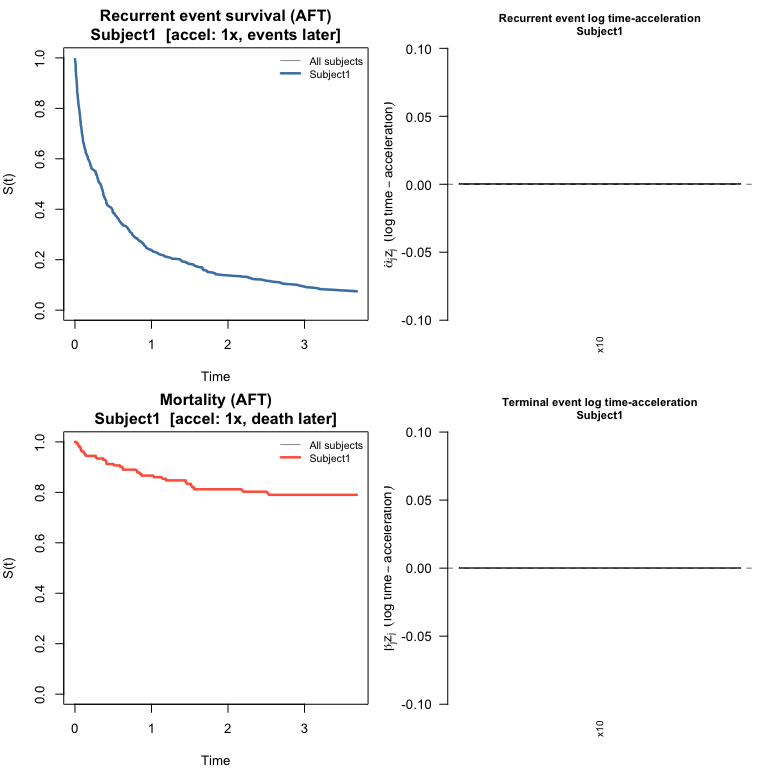
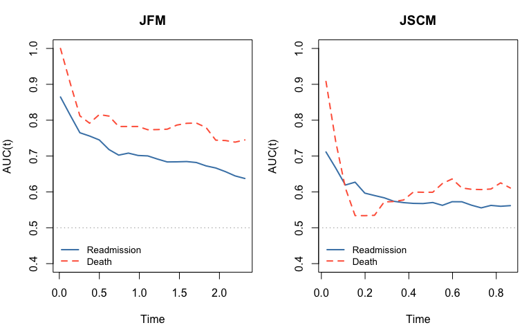

# swjm: Stagewise Variable Selection for Joint Models of Semi-Competing Risks

- [swjm: Stagewise Variable Selection for Joint Models of Semi-Competing
  Risks](#swjm-stagewise-variable-selection-for-joint-models-of-semi-competing-risks)
  - [Overview](#overview)
  - [Installation](#installation)
  - [Data format](#data-format)
  - [Workflow](#workflow)
    - [1. Simulate data](#id_1-simulate-data)
    - [2. Fit the stagewise regularization
      path](#id_2-fit-the-stagewise-regularization-path)
    - [3. Plot the coefficient path](#id_3-plot-the-coefficient-path)
    - [4. Cross-validation to select the tuning
      parameter](#id_4-cross-validation-to-select-the-tuning-parameter)
    - [5. Plot the cross-validation
      results](#id_5-plot-the-cross-validation-results)
    - [6. Summarize the chosen model](#id_6-summarize-the-chosen-model)
    - [7. Baseline hazard](#id_7-baseline-hazard)
    - [8. Predict survival curves](#id_8-predict-survival-curves)
    - [9. Plot survival curves and predictor
      contributions](#id_9-plot-survival-curves-and-predictor-contributions)
    - [10. JSCM workflow (cross-validation + survival
      prediction)](#id_10-jscm-workflow-cross-validation--survival-prediction)
    - [11. Other penalties](#id_11-other-penalties)
  - [12. Model evaluation](#id_12-model-evaluation)
    - [12.1 Coefficient recovery](#id_121-coefficient-recovery)
    - [12.2 Time-varying AUC](#id_122-time-varying-auc)
  - [Package conventions](#package-conventions)

## Overview

`swjm` implements stagewise (forward-stepwise) variable selection for
joint models of recurrent events and terminal events (semi-competing
risks). Two model frameworks are supported:

| Model    | Type               | `alpha` (first *p*)    | `beta` (second *p*) |
|----------|--------------------|------------------------|---------------------|
| **JFM**  | Cox frailty        | recurrence/readmission | terminal/death      |
| **JSCM** | Scale-change (AFT) | recurrence/readmission | terminal/death      |

Three penalty types are available: cooperative lasso (`"coop"`), lasso
(`"lasso"`), and group lasso (`"group"`). The cooperative lasso
encourages shared support between the readmission and death coefficient
vectors.

## Installation

``` r

# From the package directory:
devtools::install("swjm")
```

## Data format

All functions expect a data frame with columns `id`, `t.start`,
`t.stop`, `event` (1 = readmission, 0 = terminal/censoring row),
`status` (1 = death, 0 = alive/censored), and covariate columns
`x1, ..., xp`.

------------------------------------------------------------------------

## Workflow

### 1. Simulate data

``` r

library(swjm)

# Joint Frailty Model — scenario 1
set.seed(42)
dat_jfm  <- generate_data(n = 200, p = 100, scenario = 1, model = "jfm")
Data_jfm <- dat_jfm$data

# JSCM — same scenario
set.seed(42)
dat_jscm  <- generate_data(n = 200, p = 100, scenario = 1, model = "jscm")
#> Call: 
#> reReg::simGSC(n = n, summary = TRUE, para = para, xmat = X, censoring = C, 
#>     frailty = gamma, tau = 60)
#> 
#> Summary:
#> Sample size:                                    200 
#> Number of recurrent event observed:             343 
#> Average number of recurrent event per subject:  1.715 
#> Proportion of subjects with a terminal event:   0.175
Data_jscm <- dat_jscm$data
```

JFM data: n = 200 subjects, 382 readmission events, 48 deaths

### 2. Fit the stagewise regularization path

``` r

fit_jfm <- stagewise_fit(Data_jfm, model = "jfm", penalty = "coop")
fit_jfm
#> Stagewise path (jfm/coop)
#> 
#>   Covariates (p):            100
#>   Iterations:                5000
#>   Lambda range:              [0.08902, 1.301]
#>   Active at final step:      44 readmission, 34 death
#>     Readmission (alpha): 1, 2, 3, 4, 5, 7, 9, 10, 12, 14, 15, 17, 23, 33, 35, 37, 38, 39, 41, 43, 47, 49, 52, 55, 57, 60, 62, 64, 66, 67, 69, 71, 73, 74, 77, 79, 80, 82, 92, 93, 95, 96, 97, 98
#>     Death (beta):        3, 4, 5, 7, 9, 10, 12, 14, 15, 17, 25, 37, 38, 39, 41, 43, 47, 49, 52, 57, 60, 62, 66, 67, 73, 74, 78, 80, 82, 84, 95, 96, 97, 98
```

The fit object now exposes `alpha` (readmission) and `beta` (death) as
separate *p* × (*k*+1) matrices — one column per stagewise step — in
addition to the combined `theta` matrix (2*p* × (*k*+1)):

``` r

p <- 100
k_final <- ncol(fit_jfm$alpha)
a_final <- round(fit_jfm$alpha[, k_final], 4)
```

- alpha matrix: 100 rows x 5001 columns
- beta matrix: 100 rows x 5001 columns

Nonzero alpha entries at final step:

``` r

a_final[a_final != 0]
#>  [1]  1.0057 -0.9787  0.0183 -0.0577  0.0185  0.0151  0.9614 -0.8484  0.0124
#> [10]  0.0423 -0.0284  0.0199 -0.0020  0.0240 -0.0240  0.0064  0.0781 -0.0061
#> [19]  0.0125  0.0046 -0.0429  0.0396  0.0092  0.0680 -0.0550 -0.0500 -0.0007
#> [28]  0.0200  0.0742  0.0005 -0.0350  0.0370  0.0099 -0.0234  0.0450  0.0790
#> [37] -0.0072  0.0013 -0.0200  0.0150  0.0085  0.0027 -0.0618  0.0272
```

[`summary()`](https://rdrr.io/r/base/summary.html) shows a compact table
of path-end coefficients with variable type (shared, readmission-only,
or death-only):

``` r

summary(fit_jfm)
#> Stagewise path (jfm/coop)
#> 
#>   p = 100  |  5000 iterations  |  lambda: [0.08902, 1.301]
#>   Decreasing path: 784 steps
#> 
#>   Path-end coefficients (nonzero variables):
#> 
#>   Variable    alpha       beta        Type
#>   ----------  ----------  ----------  ----------------
#>   x9          +0.9614     +0.6629     shared (+)
#>   x4          -0.0577     -0.9979     shared (+)
#>   x10         -0.8484     -0.7274     shared (+)
#>   x2          -0.9787          —    readmission only
#>   x3          +0.0183     +0.8049     shared (+)
#>   x74         -0.0234     -0.3101     shared (+)
#>   x1          +1.0057          —    readmission only
#>   x67         +0.0005     +0.1393     shared (+)
#>   x57         -0.0550     +0.1330     shared (–)
#>   x38         +0.0781     +0.0857     shared (+)
#>   x97         -0.0618     -0.0583     shared (+)
#>   x66         +0.0742     +0.0415     shared (+)
#>   x41         +0.0125     +0.0937     shared (+)
#>   x55         +0.0680          —    readmission only
#>   x79         +0.0790          —    readmission only
#>   x60         -0.0500     +0.0070     shared (–)
#>   x49         +0.0396     +0.0305     shared (+)
#>   x98         +0.0272     +0.0792     shared (+)
#>   x15         -0.0284     -0.0639     shared (+)
#>   x7          +0.0151     +0.1160     shared (+)
#>   x82         +0.0013     +0.0750     shared (+)
#>   x5          +0.0185     +0.0527     shared (+)
#>   x39         -0.0061     -0.0657     shared (+)
#>   x14         +0.0423     +0.0076     shared (+)
#>   x47         -0.0429     -0.0135     shared (+)
#>   x71         +0.0370          —    readmission only
#>   x77         +0.0450          —    readmission only
#>   x69         -0.0350          —    readmission only
#>   x35         -0.0240          —    readmission only
#>   x33         +0.0240          —    readmission only
#>   x17         +0.0199     +0.0020     shared (+)
#>   x84              —    -0.0790     death only
#>   x37         +0.0064     +0.0394     shared (+)
#>   x78              —    +0.0710     death only
#>   x64         +0.0200          —    readmission only
#>   x92         -0.0200          —    readmission only
#>   x25              —    +0.0200     death only
#>   x80         -0.0072     -0.0165     shared (+)
#>   x93         +0.0150          —    readmission only
#>   x12         +0.0124     +0.0085     shared (+)
#>   x73         +0.0099     +0.0084     shared (+)
#>   x95         +0.0085     +0.0170     shared (+)
#>   x52         +0.0092     +0.0092     shared (+)
#>   x43         +0.0046     +0.0038     shared (+)
#>   x96         +0.0027     +0.0054     shared (+)
#>   x23         -0.0020          —    readmission only
#>   x62         -0.0007     -0.0007     shared (+)
#> 
#>   Inactive: x6, x8, x11, x13, x16, x18, x19, x20, x21, x22, x24, x26, x27, x28, x29, x30, x31, x32, x34, x36, x40, x42, x44, x45, x46, x48, x50, x51, x53, x54, x56, x58, x59, x61, x63, x65, x68, x70, x72, x75, x76, x81, x83, x85, x86, x87, x88, x89, x90, x91, x94, x99, x100
```

### 3. Plot the coefficient path

[`plot()`](https://rdrr.io/r/graphics/plot.default.html) produces a
glmnet-style coefficient trajectory plot with the number of active
variables on the top axis:

``` r

plot(fit_jfm)
```



### 4. Cross-validation to select the tuning parameter

[`cv_stagewise()`](http://jaredhuling.org/swjm/reference/cv_stagewise.md)
evaluates a cross-fitted estimating-equation score norm over a grid of
lambda values.

``` r

lambda_path <- fit_jfm$lambda
dec_idx     <- swjm:::extract_decreasing_indices(lambda_path)
lambda_seq  <- lambda_path[dec_idx]

cv_jfm <- cv_stagewise(
  Data_jfm, model = "jfm", penalty = "coop",
  lambda_seq = lambda_seq, K = 3L
)
cv_jfm
#> Cross-validation (jfm/coop)
#> 
#>   Covariates (p):              100
#>   Lambda grid size:            784
#>   Best position (combined):    438  (lambda = 0.9241)
#>   Selected variables:          8 readmission, 6 death
#>     Readmission (alpha): 1, 2, 3, 4, 9, 10, 67, 74
#>     Death (beta):        3, 4, 9, 10, 67, 74
```

The CV object stores `alpha` and `beta` at the optimal lambda, plus
`n_active_alpha`, `n_active_beta`, and `n_active` variable-count vectors
across the full lambda grid.

### 5. Plot the cross-validation results

``` r

plot(cv_jfm)
```



### 6. Summarize the chosen model

``` r

# summary() shows a formatted table of selected coefficients
summary(cv_jfm)
#> CV-selected model (jfm/coop)
#> 
#>   p = 100  |  Lambda grid: 784 steps  |  CV optimal: step 438 (lambda = 0.9241)
#> 
#>   Selected coefficients  (8 readmission, 6 death):
#> 
#>   Variable    alpha       beta        Type
#>   ----------  ----------  ----------  ----------------
#>   x9          +0.4338     +0.4528     shared (+)
#>   x4          -0.0466     -0.8184     shared (+)
#>   x10         -0.3531     -0.4622     shared (+)
#>   x3          +0.0075     +0.6503     shared (+)
#>   x2          -0.2507          —    readmission only
#>   x74         -0.0162     -0.1793     shared (+)
#>   x1          +0.1597          —    readmission only
#>   x67         +0.0004     +0.0133     shared (+)
#> 
#>   Inactive (92): x5, x6, x7, x8, x11, x12, x13, x14, x15, x16, x17, x18, x19, x20, x21, x22, x23, x24, x25, x26, x27, x28, x29, x30, x31, x32, x33, x34, x35, x36, x37, x38, x39, x40, x41, x42, x43, x44, x45, x46, x47, x48, x49, x50, x51, x52, x53, x54, x55, x56, x57, x58, x59, x60, x61, x62, x63, x64, x65, x66, x68, x69, x70, x71, x72, x73, x75, x76, x77, x78, x79, x80, x81, x82, x83, x84, x85, x86, x87, x88, x89, x90, x91, x92, x93, x94, x95, x96, x97, x98, x99, x100
```

Direct access to selected coefficients:

``` r

# coef() returns the combined numeric vector c(alpha, beta) for compatibility
theta_best <- coef(cv_jfm)
```

- Selected readmission (alpha) variables: 1 2 3 4 9 10 67 74
- Selected death (beta) variables: 3 4 9 10 67 74

### 7. Baseline hazard

[`baseline_hazard()`](http://jaredhuling.org/swjm/reference/baseline_hazard.md)
evaluates the cumulative baseline hazards at any desired time points
(Breslow for JFM; Nelson-Aalen on the accelerated scale for JSCM):

``` r

bh <- baseline_hazard(cv_jfm, times = c(0.5, 1.0, 2.0, 4.0, 6.0))
print(bh)
#>   time cumhaz_readmission cumhaz_death
#> 1  0.5          0.8302786   0.04821411
#> 2  1.0          1.3776457   0.06859515
#> 3  2.0          1.9078200   0.12461276
#> 4  4.0          3.1933429   0.28725353
#> 5  6.0          4.5481622   0.33588232
```

### 8. Predict survival curves

[`predict()`](https://rdrr.io/r/stats/predict.html) computes
subject-specific readmission-free and death-free survival curves,
together with the per-predictor contributions to each linear predictor:

``` r

# Three hypothetical new subjects (covariate vectors of length p = 100)
set.seed(7)
newz <- matrix(rnorm(300), nrow = 3, ncol = 100)
colnames(newz) <- paste0("x", 1:100)

pred <- predict(cv_jfm, newdata = newz)
pred
#> swjm predictions (jfm)
#> 
#>   Subjects:                3
#>   Time points:             430
#>   Time range:              [0.0002844, 6.281]
#> 
#>   Use plot() to visualize survival curves and predictor contributions.

# S_re: readmission-free survival — first 10 time points
round(pred$S_re[, 1:10], 3)
#>          t=0.0002844 t=0.0009392 t=0.001171 t=0.001381 t=0.001936 t=0.002432
#> Subject1       0.992       0.983      0.983      0.974      0.966      0.957
#> Subject2       0.994       0.987      0.987      0.980      0.973      0.967
#> Subject3       0.994       0.987      0.987      0.981      0.974      0.967
#>          t=0.004535 t=0.004809 t=0.006178 t=0.006205
#> Subject1      0.949      0.940      0.932      0.923
#> Subject2      0.960      0.953      0.947      0.940
#> Subject3      0.961      0.954      0.948      0.941

# Predictor contributions for subject 1 — show only nonzero entries
contrib1 <- round(pred$contrib_re[1, ], 3)
contrib1[contrib1 != 0]
#>     x1     x2     x3     x4     x9    x10    x74 
#>  0.365  0.103  0.006 -0.102  0.552 -0.209  0.007
```

### 9. Plot survival curves and predictor contributions

[`plot()`](https://rdrr.io/r/graphics/plot.default.html) on a
`swjm_pred` object draws four panels: survival curves for both processes
(all subjects in grey, highlighted subject in color) plus bar charts of
predictor contributions for the selected subject.

``` r

plot(pred, which_subject = 1)
```



------------------------------------------------------------------------

### 10. JSCM workflow (cross-validation + survival prediction)

The same workflow applies to the JSCM.
[`baseline_hazard()`](http://jaredhuling.org/swjm/reference/baseline_hazard.md)
and [`predict()`](https://rdrr.io/r/stats/predict.html) now work for
both models: for JSCM, survival curves are estimated via a Nelson-Aalen
baseline on the accelerated time scale. In the AFT interpretation,
$`e^{\hat\alpha^\top z_i}`$ is the time-acceleration factor for subject
$`i`$: greater than 1 means events happen sooner, less than 1 means
later.

``` r

fit_jscm <- stagewise_fit(Data_jscm, model = "jscm", penalty = "coop")

lambda_path_jscm <- fit_jscm$lambda
dec_idx_jscm     <- swjm:::extract_decreasing_indices(lambda_path_jscm)
lambda_seq_jscm  <- lambda_path_jscm[dec_idx_jscm]

cv_jscm <- cv_stagewise(
  Data_jscm, model = "jscm", penalty = "coop",
  lambda_seq = lambda_seq_jscm, K = 3L
)
summary(cv_jscm)
#> CV-selected model (jscm/coop)
#> 
#>   p = 100  |  Lambda grid: 30 steps  |  CV optimal: step 3 (lambda = 0.6838)
#> 
#>   Selected coefficients  (1 readmission, 1 death):
#> 
#>   Variable    alpha       beta        Type
#>   ----------  ----------  ----------  ----------------
#>   x10         -0.0180     -0.0088     shared (+)
#> 
#>   Inactive (99): x1, x2, x3, x4, x5, x6, x7, x8, x9, x11, x12, x13, x14, x15, x16, x17, x18, x19, x20, x21, x22, x23, x24, x25, x26, x27, x28, x29, x30, x31, x32, x33, x34, x35, x36, x37, x38, x39, x40, x41, x42, x43, x44, x45, x46, x47, x48, x49, x50, x51, x52, x53, x54, x55, x56, x57, x58, x59, x60, x61, x62, x63, x64, x65, x66, x67, x68, x69, x70, x71, x72, x73, x74, x75, x76, x77, x78, x79, x80, x81, x82, x83, x84, x85, x86, x87, x88, x89, x90, x91, x92, x93, x94, x95, x96, x97, x98, x99, x100
```

``` r

set.seed(7)
newz_jscm <- matrix(runif(600, -1, 1), nrow = 3, ncol = 100)
#> Warning in matrix(runif(600, -1, 1), nrow = 3, ncol = 100): data length differs
#> from size of matrix: [600 != 3 x 100]

pred_jscm <- predict(cv_jscm, newdata = newz_jscm)
```

Recurrence time-acceleration factors:

``` r

round(pred_jscm$time_accel_re, 3)
#> Subject1 Subject2 Subject3 
#>    1.000    0.983    1.005
```

[`plot()`](https://rdrr.io/r/graphics/plot.default.html) draws the same
four-panel layout as for JFM: survival curves for both processes plus
bar charts of log time-acceleration contributions.

``` r

plot(pred_jscm, which_subject = 1)
```



------------------------------------------------------------------------

### 11. Other penalties

``` r

fit_lasso <- stagewise_fit(Data_jfm, model = "jfm", penalty = "lasso")
cv_lasso  <- cv_stagewise(Data_jfm, model = "jfm", penalty = "lasso", K = 3L)
summary(cv_lasso)

fit_group <- stagewise_fit(Data_jfm, model = "jfm", penalty = "group")
cv_group  <- cv_stagewise(Data_jfm, model = "jfm", penalty = "group", K = 3L)
summary(cv_group)
```

------------------------------------------------------------------------

## 12. Model evaluation

### 12.1 Coefficient recovery

Compare CV-optimal estimates to the true generating coefficients.
Variables that are truly nonzero or were selected are shown; all others
were correctly excluded.

``` r

p <- 100

# JFM: variables of interest (true signal or selected)
show_jfm <- sort(which(dat_jfm$alpha_true != 0 | cv_jfm$alpha != 0 |
                       dat_jfm$beta_true  != 0 | cv_jfm$beta  != 0))

coef_df <- data.frame(
  variable   = paste0("x", show_jfm),
  true_alpha = round(dat_jfm$alpha_true[show_jfm], 3),
  est_alpha  = round(cv_jfm$alpha[show_jfm],       3),
  true_beta  = round(dat_jfm$beta_true[show_jfm],  3),
  est_beta   = round(cv_jfm$beta[show_jfm],        3)
)
colnames(coef_df) <- c("variable", "alpha_true", "alpha_est", "beta_true", "beta_est")
print(coef_df, row.names = FALSE)
#>  variable alpha_true alpha_est beta_true beta_est
#>        x1        1.1     0.160       0.1    0.000
#>        x2       -1.1    -0.251      -0.1    0.000
#>        x3        0.1     0.007       1.1    0.650
#>        x4       -0.1    -0.047      -1.1   -0.818
#>        x9        1.0     0.434       1.0    0.453
#>       x10       -1.0    -0.353      -1.0   -0.462
#>       x67        0.0     0.000       0.0    0.013
#>       x74        0.0    -0.016       0.0   -0.179
```

JFM alpha: TP=6 FP=2 FN=0 \| beta: TP=4 FP=2 FN=2

``` r

show_jscm <- sort(which(dat_jscm$alpha_true != 0 | cv_jscm$alpha != 0 |
                        dat_jscm$beta_true  != 0 | cv_jscm$beta  != 0))

coef_jscm <- data.frame(
  variable   = paste0("x", show_jscm),
  true_alpha = round(dat_jscm$alpha_true[show_jscm], 3),
  est_alpha  = round(cv_jscm$alpha[show_jscm],        3),
  true_beta  = round(dat_jscm$beta_true[show_jscm],  3),
  est_beta   = round(cv_jscm$beta[show_jscm],         3)
)
colnames(coef_jscm) <- c("variable", "alpha_true", "alpha_est", "beta_true", "beta_est")
print(coef_jscm, row.names = FALSE)
#>  variable alpha_true alpha_est beta_true beta_est
#>        x1        1.1     0.000       0.1    0.000
#>        x2       -1.1     0.000      -0.1    0.000
#>        x3        0.1     0.000       1.1    0.000
#>        x4       -0.1     0.000      -1.1    0.000
#>        x9        1.0     0.000       1.0    0.000
#>       x10       -1.0    -0.018      -1.0   -0.009
```

JSCM alpha: TP=1 FP=0 FN=5 \| beta: TP=1 FP=0 FN=5

### 12.2 Time-varying AUC

We use the `timeROC` package (Blanche et al., 2013) to compute
cause-specific time-varying AUC in the competing-risk framework. Each
subject contributes at most a first-readmission event (cause 1) and a
death event (cause 2). Each sub-model is assessed with its own linear
predictor: $`\hat\alpha^\top z_i`$ for readmission,
$`\hat\beta^\top z_i`$ for death.

> **Note**: AUC is evaluated on the training data for illustration. In
> practice use held-out or cross-validated predictions.

``` r

# Construct competing-risk dataset:
# Keep first readmission (event==1 & t.start==0) + death/censor (event==0).
# Status: 1 = first readmission, 2 = death, 0 = censored.
.cr_data <- function(Data) {
  d3 <- Data[Data$event == 0 | (Data$event == 1 & Data$t.start == 0), ]
  d3 <- d3[order(d3$id, d3$t.start, d3$t.stop), ]
  status <- ifelse(d3$event == 1 & d3$status == 0, 1L,
             ifelse(d3$event == 0 & d3$status == 0, 0L, 2L))
  list(data = d3, status = status)
}

cr_jfm  <- .cr_data(Data_jfm)
cr_jscm <- .cr_data(Data_jscm)

# Baseline covariates (one row per subject)
Z_jfm  <- as.matrix(Data_jfm[!duplicated(Data_jfm$id),   paste0("x", 1:p)])
Z_jscm <- as.matrix(Data_jscm[!duplicated(Data_jscm$id), paste0("x", 1:p)])

# Markers expanded to row level: alpha^T z for readmission, beta^T z for death
M_re_jfm  <- drop(Z_jfm  %*% cv_jfm$alpha)[cr_jfm$data$id]
M_de_jfm  <- drop(Z_jfm  %*% cv_jfm$beta)[cr_jfm$data$id]
M_re_jscm <- drop(Z_jscm %*% cv_jscm$alpha)[cr_jscm$data$id]
M_de_jscm <- drop(Z_jscm %*% cv_jscm$beta)[cr_jscm$data$id]
```

``` r

if (!requireNamespace("timeROC", quietly = TRUE))
  install.packages("timeROC")
library(survival)
library(timeROC)

# Evaluation grid: 20 points spanning the 10th-85th percentile of event times
.tgrid <- function(t_vec, status, n = 20) {
  t_ev <- t_vec[status > 0]
  seq(quantile(t_ev, 0.10), quantile(t_ev, 0.85), length.out = n)
}

t_jfm  <- .tgrid(cr_jfm$data$t.stop,  cr_jfm$status)
t_jscm <- .tgrid(cr_jscm$data$t.stop, cr_jscm$status)

# Readmission AUC: alpha^T z marker, cause = 1
roc_re_jfm <- timeROC(T = cr_jfm$data$t.stop, delta = cr_jfm$status,
                       marker = M_re_jfm, cause = 1, weighting = "marginal",
                       times = t_jfm, ROC = FALSE, iid = FALSE)
roc_re_jscm <- timeROC(T = cr_jscm$data$t.stop, delta = cr_jscm$status,
                        marker = M_re_jscm, cause = 1, weighting = "marginal",
                        times = t_jscm, ROC = FALSE, iid = FALSE)

# Death AUC: beta^T z marker, cause = 2
roc_de_jfm <- timeROC(T = cr_jfm$data$t.stop, delta = cr_jfm$status,
                       marker = M_de_jfm, cause = 2, weighting = "marginal",
                       times = t_jfm, ROC = FALSE, iid = FALSE)
roc_de_jscm <- timeROC(T = cr_jscm$data$t.stop, delta = cr_jscm$status,
                        marker = M_de_jscm, cause = 2, weighting = "marginal",
                        times = t_jscm, ROC = FALSE, iid = FALSE)
```

``` r

.get_auc <- function(roc, cause) {
  auc <- roc[[paste0("AUC_", cause)]]
  if (is.null(auc)) auc <- roc$AUC
  if (is.null(auc) || !is.numeric(auc)) return(rep(NA_real_, length(roc$times)))
  if (length(auc) == length(roc$times) + 1) auc <- auc[-1]
  as.numeric(auc)
}

old_par <- par(mfrow = c(1, 2), mar = c(4.5, 4, 3, 1))

plot(t_jfm, .get_auc(roc_re_jfm, 1), type = "l", lwd = 2, col = "steelblue",
     xlab = "Time", ylab = "AUC(t)", main = "JFM", ylim = c(0.4, 1))
lines(t_jfm, .get_auc(roc_de_jfm, 2), lwd = 2, col = "tomato", lty = 2)
abline(h = 0.5, lty = 3, col = "grey60")
legend("bottomleft", c("Readmission", "Death"),
       col = c("steelblue", "tomato"), lwd = 2, lty = c(1, 2),
       bty = "n", cex = 0.85)

plot(t_jscm, .get_auc(roc_re_jscm, 1), type = "l", lwd = 2, col = "steelblue",
     xlab = "Time", ylab = "AUC(t)", main = "JSCM", ylim = c(0.4, 1))
lines(t_jscm, .get_auc(roc_de_jscm, 2), lwd = 2, col = "tomato", lty = 2)
abline(h = 0.5, lty = 3, col = "grey60")
legend("bottomleft", c("Readmission", "Death"),
       col = c("steelblue", "tomato"), lwd = 2, lty = c(1, 2),
       bty = "n", cex = 0.85)
```



``` r


par(old_par)
```

------------------------------------------------------------------------

## Package conventions

- **`theta`** is always stored as `c(alpha, beta)`: `theta[1:p]` =
  `alpha` (readmission), `theta[(p+1):(2p)]` = `beta` (death). This
  holds for both the JFM and JSCM.
- [`stagewise_fit()`](http://jaredhuling.org/swjm/reference/stagewise_fit.md)
  also returns `alpha` and `beta` as separate *p* × (*k*+1) matrices for
  convenient access to the full regularization path.
- [`cv_stagewise()`](http://jaredhuling.org/swjm/reference/cv_stagewise.md)
  stores `alpha` and `beta` at the CV-optimal lambda, plus
  variable-count vectors `n_active_alpha`, `n_active_beta`, `n_active`.
- **Baseline hazards**: stored in `cv$baseline` and accessible via
  `baseline_hazard(cv, times)`. Works for both models: Breslow estimator
  for JFM; Nelson-Aalen on the accelerated time scale for JSCM. Used
  internally by [`predict()`](https://rdrr.io/r/stats/predict.html).
- **Survival prediction**: `predict(cv, newdata)` works for both models
  and returns a `swjm_pred` object with `S_re`, `S_de` (survival
  matrices), linear predictors `lp_re`, `lp_de`, and
  predictor-contribution matrices `contrib_re`, `contrib_de`
  ($`\hat\alpha_j z_{ij}`$ and $`\hat\beta_j z_{ij}`$).
  - **JFM**: contributions are log-hazard-ratio contributions (positive
    = higher risk).
  - **JSCM**: also returns `time_accel_re` and `time_accel_de`
    ($`e^{\hat\alpha^\top z_i}`$, $`e^{\hat\beta^\top z_i}`$) — the
    multiplicative factors by which each subject’s event times are
    scaled relative to baseline. Contributions $`\hat\alpha_j z_{ij}`$
    are log time-acceleration contributions:
    $`e^{\hat\alpha_j z_{ij}} > 1`$ shortens event times; $`< 1`$
    lengthens them.
- The **cooperative lasso** norm penalizes each variable pair
  `(alpha_j, beta_j)` with the L2 norm when signs agree, and L1 when
  they disagree — encouraging variables that affect both processes to
  enter together with the same sign.
- **Gradient scaling**: at each step the death gradient is scaled up so
  that both sub-models contribute comparably to the penalty norm.
- **Adaptive step size**: the step size at each iteration is set to one
  order of magnitude smaller than the current dual norm, which avoids
  overly large updates.
